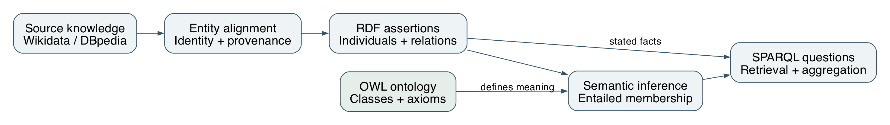
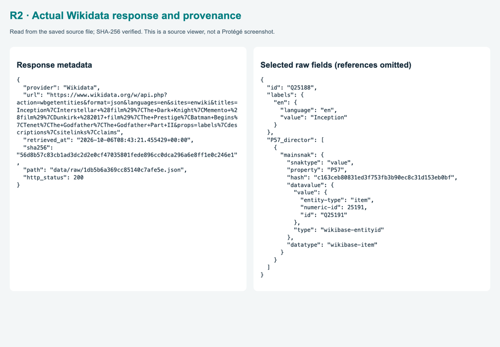
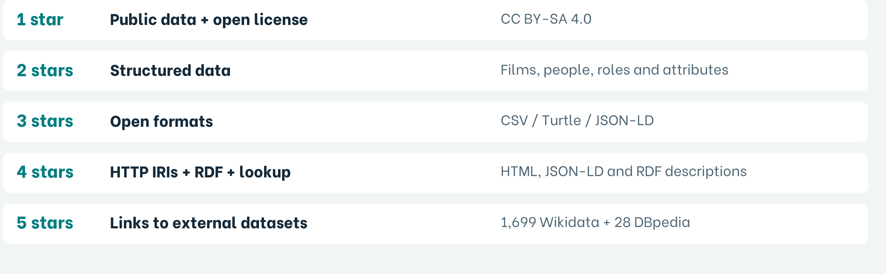
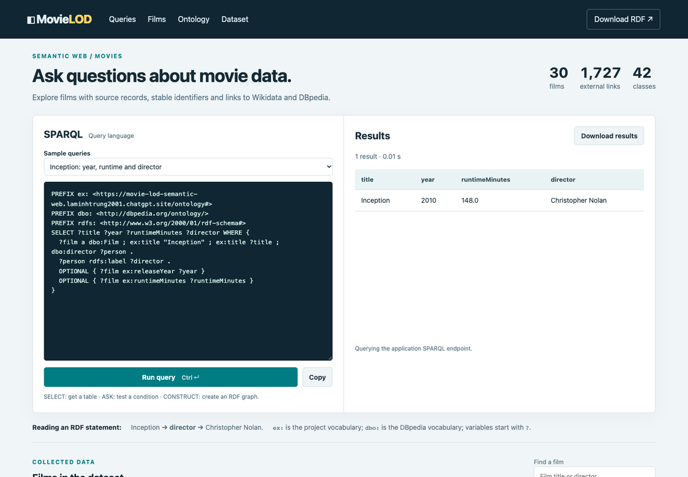
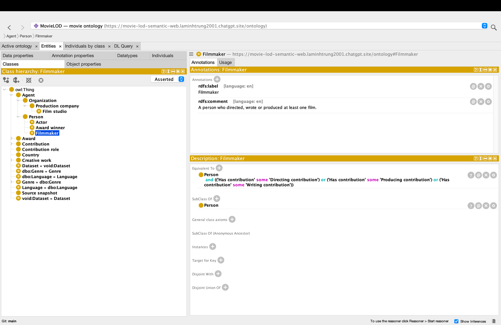

# MovieLOD: course project report (English)

Formatting: Times New Roman 13 pt; 1.5 line spacing; justified body text; A4; left 3 cm, right/top/bottom 2 cm. PDF has 15 pages including cover, contents and references.

## Page 1: Cover

Hanoi University of Science and Technology
Supervisor: TS. Đỗ Bá Lâm
Lã Minh Trung — 20251319M
Nguyễn Thu Uyên — 20252279M
Nguyễn Thị Nhã Linh — 20261262M
Nguyễn Khắc Thái Bình — 20251324M

<!-- page break -->

## Page 2: TABLE OF CONTENTS

1. INTRODUCTION AND OBJECTIVES … 3
  1.1 Abstract and problem statement … 3
  1.2 Research objectives and competency questions … 3
  1.3 Scope and evaluation approach … 3
2. CONCEPTUAL FRAMEWORK … 4
  2.1 From heterogeneous sources to a knowledge graph … 4
  2.2 Representation and interpretation … 4
3. DATA ACQUISITION AND PROVENANCE … 5
4. NORMALIZATION AND RDF GENERATION … 6
5. ONTOLOGY STRUCTURE … 7
6. CONTRIBUTION MODEL … 8
7. PROPERTIES AND OWL CONSTRAINTS … 9
8. PUBLICATION AND FOUR-STAR DATA … 10
9. EXTERNAL IDENTITY LINKS … 11
10. SPARQL AND COMPETENCY QUESTIONS … 12
11. REASONING AND INTERPRETATION … 13
12. EVALUATION AND LIMITATIONS … 14
13. CONCLUSION AND REFERENCES … 15
  13.1 Conclusion and future work … 15
  13.2 References … 15

<!-- page break -->

## Page 3: 1. INTRODUCTION AND OBJECTIVES

### 1.1 Abstract and problem statement

MovieLOD combines Wikidata and DBpedia responses with an OWL ontology, RDF publication, external identity links and three query interfaces. Its selected sample contains 30 films, 42 declared classes, 19,339 data triples and 1,727 identity links. Source integrity and query behavior are verified; HermiT and Pellet confirm consistency and matching inferred populations. Application counting is distinguished from OWL DL inference. The motivating problem is that movie information uses different identifiers and overlapping roles across sources. Inception and Christopher Nolan illustrate how one person can direct, write and produce the same film without losing the identity or provenance of each contribution.

### 1.2 Research objectives and competency questions

Table 1. Competency questions guiding ontology design and evaluation.

| ID | Competency question | Knowledge required |
| --- | --- | --- |
| CQ1 | Who directed a film? | Film, Person and director relation |
| CQ2 | Which roles did one person hold? | Person–film–role association |
| CQ3 | How are films grouped by genre? | Genre taxonomy and film membership |
| CQ4 | Which external entities identify a film? | Identity alignment across datasets |
| CQ5 | Which types follow from stated facts? | Class definitions and entailment |

### 1.3 Scope and evaluation approach

The selected sample is a case study rather than a comprehensive film catalogue. Evaluation examines whether the conceptual model represents the domain coherently and answers the competency questions. Three levels are distinguished: source assertions, logically entailed types, and application-defined aggregation. This distinction permits a meaningful assessment of semantic expressiveness without treating the sample as representative of the entire film industry.

<!-- page break -->

## Page 4: 2. CONCEPTUAL FRAMEWORK



### 2.1 From heterogeneous sources to a knowledge graph

The study combines complementary source descriptions through a common conceptual model. Entity alignment identifies which records refer to the same film or person. RDF then expresses the aligned descriptions as relationships and typed values. The ontology supplies a vocabulary and axioms that make these relationships interpretable. Semantic inference adds consequences of the axioms, while SPARQL retrieves both stated and entailed knowledge. Provenance provides a basis for interpreting where each description originated.

Table 2. Distinct knowledge layers used in the study.

| Knowledge layer | Semantic role |
| --- | --- |
| Terminological knowledge (TBox/RBox) | Classes, properties and restrictions |
| Assertional knowledge (ABox) | Individuals, relationships and literal values |
| Entailed knowledge | Consequences of assertions and axioms |

### 2.2 Representation and interpretation

Separating the layers supports a precise interpretation of query answers. A person may be explicitly described as a Person while satisfying the definition of Filmmaker through a contribution. The additional type follows from the ontology, not a new source statement. Conversely, an aggregation over distinct RDF terms is a query operation and may not establish an OWL cardinality restriction. The framework therefore separates logical entailment from data summarization.

<!-- page break -->

## Page 5: 3. DATA ACQUISITION AND PROVENANCE

Wikidata entities are resolved through exact English Wikipedia sitelinks. The collector retrieves film claims and the related people, companies, awards and terms. DBpedia matches are accepted only when the resource corresponds to the expected title and is typed as a Film. This conservative rule produces 28 DBpedia film links; missing matches are not guessed [4,5].

Table 3. Main source properties used by the collector.

| Claim group | Wikidata properties |
| --- | --- |
| People and roles | P57 director; P161 cast; P58 writer; P162 producer |
| Film context | P136 genre; P495 country; P364 language |
| Dates, runtime and organizations | P577 release; P2047 runtime; P166 award; P272 company |



Provenance associates an assertion with its source and retrieval context. The corpus contains 76 retained source responses, allowing normalized claims to be traced to their original descriptions. This is important because source content can evolve, and a later response may differ from the one used in the study. Integrity checks establish that a retained response is unchanged; they do not establish that the source claim is true. Provenance, entity matching and semantic validation therefore address different aspects of data quality.

<!-- page break -->

## Page 6: 4. NORMALIZATION AND RDF GENERATION

QIDs form stable local identifiers for films, people and other entities. The build step maps source claims to ontology properties, normalizes runtime units to minutes and records ambiguous or multiple values for review. Source snapshots remain available so a normalized statement can be traced back to the exact response. The current sample includes 30 films, 851 people, 1,010 contributions, 45 companies and 672 award entities.

```
res:film-Q25188 a dbo:Film ;
  ex:title "Inception" ;
  ex:releaseYear 2010 ;
  ex:runtimeMinutes "148.0"^^xsd:decimal ;
  dbo:director res:person-Q25191 .
```


The representation contains 19,339 assertional triples and 518 schema triples. Turtle and JSON-LD express the same graph: their surface syntax differs, but their statements are equivalent. Datatypes distinguish a numeric duration from a textual title and permit meaningful comparison and aggregation. This also illustrates the distinction between an entity and its attributes: Nolan is identified by an IRI, whereas 148 minutes is a literal value. Normalization supports semantic interoperability by representing comparable quantities in a common unit [6].

<!-- page break -->

## Page 7: 5. ONTOLOGY STRUCTURE

The ontology declares 42 named classes organized around films, agents, contributions, genres, awards and contextual information. dbo:Film, dbo:Person and dbo:Country reuse DBpedia vocabulary; 39 declarations express concepts specific to the study. Vocabulary reuse supports interoperability, while local definitions address modeling requirements that a general film description does not capture. Human-readable labels and comments clarify intended meaning without replacing formal axioms.


Table 4. Six conceptual groups, totaling 42 declared classes.

| Concept group | Declared classes |
| --- | --- |
| CreativeWork / Film; Agent / Person / Organization | 11; 8 |
| Contribution / roles; Genre; Award | 6; 8; 5 |
| Country / Language / SourceSnapshot / Dataset | 4 |

Film subclasses include FeatureFilm, AnimatedFilm and DocumentaryFilm, together with genre-based and award-based classes. The P31 mapping yields 29 FeatureFilm and one AnimatedFilm in this sample. DocumentaryFilm has no instances. Actor and Filmmaker overlap by design; Person and Organization represent different categories of agent. Genre and award subgroups are mapped from source-label keywords and require review when the dataset is expanded.

<!-- page break -->

## Page 8: 6. CONTRIBUTION MODEL

Contribution represents a person-film-role association. contributionBy identifies the person, contributionTo the film, and hasRole one of four role individuals: DirectorRole, ActorRole, WriterRole or ProducerRole. Separate records preserve multiple roles without inventing a combined profession class. Nolan’s directing, writing and producing contributions to Inception are therefore three records, not three people.


Table 5. Role distribution returned by the full Inception query.

| Inception role | Contribution records |
| --- | --- |
| Actor | 21 |
| Director / Writer / Producer | 1 / 1 / 2 |
| Total | 25 |

The contribution node represents a ternary association through three binary relations. Compared with a direct director or starring edge, it makes the person–film–role context explicit and permits association-level provenance. The additional nodes increase representation size but support extensions such as credit order or role-specific dates. Inverse relationships enable navigation from either a person or a film. The 1,010 contribution records must therefore be interpreted as contextual associations, not 1,010 distinct people.

<!-- page break -->

## Page 9: 7. PROPERTIES AND OWL CONSTRAINTS

The model declares 23 object properties and six data properties. Object properties connect entities, whereas data properties connect individuals to typed values. contributionBy, contributionTo and hasRole are functional and have qualified exactly-one restrictions. Universal restrictions constrain the types of their fillers. Together, these axioms characterize a Contribution as an association with one person, one film and one role, rather than an unrestricted collection of relationships.


Table 6. All six declared data properties.

| Data property | Datatype |
| --- | --- |
| title; sha256 | xsd:string |
| releaseYear; runtimeMinutes | xsd:integer; xsd:decimal |
| sourceUrl; retrievedAt | xsd:anyURI; xsd:dateTime |

OWL interprets restrictions semantically. Domain and range can support type inference, while absence of a statement does not imply its negation. Different identifiers are not automatically different individuals. Thus, an exactly-one restriction is not equivalent to requiring a filled database field. Disjointness expresses incompatibility between categories, while equivalent-class definitions characterize membership using intersections, unions, existential restrictions and fixed values. These distinctions determine which conclusions are justified [1].

<!-- page break -->

## Page 10: 8. PUBLICATION AND FOUR-STAR DATA

MovieLOD publishes RDF using HTTP IRIs and a CC BY-SA 4.0 data license. Turtle and JSON-LD are open serializations of the same graph; CSV is provided for convenience but is not itself RDF. The four-star claim depends on public access, an open license and useful descriptions reached through identifiers, rather than the existence of local files alone [3].


An IRI description connects the identity of a resource with information about it. For Inception, the description includes its types, title, duration, director, contributions, contextual entities and source associations. Human-readable presentation and machine-readable RDF serve complementary audiences. Consumers can follow these relationships to explore connected resources rather than treating a film as an isolated record.

The academic significance of publication is interoperability: another consumer can interpret the identifiers and reuse the statements without adopting the original application. An open license establishes reuse conditions, while standard RDF representations preserve meaning across tools. External links extend this principle across datasets. Publication alone does not guarantee semantic accuracy; the quality of the model, matching decisions and source claims remains essential.

<!-- page break -->

## Page 11: 9. EXTERNAL IDENTITY LINKS

Entity alignment yields 1,699 Wikidata and 28 DBpedia owl:sameAs statements, totaling 1,727 identity links. These concern films, people and related entities; the film-only query returns 58 links. Matching combines identifiers, exact title associations and compatible entity types. This conservative approach prioritizes justified identity assertions over maximizing the number of links.



```
res:film-Q25188 owl:sameAs
  <http://www.wikidata.org/entity/Q25188>,
  <http://dbpedia.org/resource/Inception> .
```

sameAs means that identifiers denote the same entity. It differs from reusing dbo:Film as vocabulary and from sourceSnapshot as provenance. Identity links require careful matching because reasoning can propagate statements across aliases. The application therefore filters local resource namespaces when counting inferred instances, preventing Wikidata and DBpedia aliases from inflating totals.

Table 7. Link counts and their scopes.

| Measure | Recorded result |
| --- | --- |
| All identity links | 1,727 |
| Wikidata / DBpedia links | 1,699 / 28 |
| Film-only link query | 58 rows |

<!-- page break -->

## Page 12: 10. SPARQL AND COMPETENCY QUESTIONS

SPARQL operationalizes the competency questions through graph patterns. SELECT retrieves bindings, ASK evaluates whether a pattern has a solution, and CONSTRUCT creates a graph from matching data [2]. In the Inception example, the query joins the film’s title and director relationship with the person’s label. OPTIONAL permits a result even when a descriptive attribute is absent.



Table 8. Selected query outputs.

| Question | Verified result |
| --- | --- |
| Inception year / runtime / director | 2010 / 148 min / Christopher Nolan |
| Nolan films; Inception companies | 8 films; 4 companies |
| Inception actors; Godfather awards | 21 actors; 7 awards |

The query examples demonstrate structural expressiveness: one pattern retrieves a film’s attributes, another follows contributions to roles, and an aggregation summarizes films by genre. Taxonomic queries can use subclass relationships to retrieve broader categories. Answers depend on the knowledge considered: asserted Person membership differs from entailed Filmmaker membership. LIMIT restricts displayed solutions rather than the population of a class. A useful interpretation of an answer therefore states its graph scope and counting unit.

<!-- page break -->

## Page 13: 11. REASONING AND INTERPRETATION

Reasoning evaluates whether the assertions and axioms admit a consistent interpretation and determines additional class memberships. Independent classification with HermiT and Pellet found the knowledge base consistent and no named class unsatisfiable. Both reasoners agreed on the populations reported below. This agreement supports the interpretation of the model; it is not evidence that every source claim is factually correct.



Table 9. Local instance counts independently confirmed by both reasoners.

| Class group | HermiT / Pellet result |
| --- | --- |
| Actor; Filmmaker; AwardWinner | 769; 89; 290 |
| Acting / Directing / Writing / ProducingContribution | 855 / 31 / 51 / 73 |
| Action / Comedy / Drama / ScienceFiction / AwardWinningFilm | 12 / 4 / 25 / 6 / 26 |
| MultiGenreFilm; FilmStudio | 0; 0 DL-inferred instances |

Nolan satisfies Filmmaker through a directing, writing or producing contribution and AwardWinner through an award association. Twelve populations agree with OWL RL classification. In contrast, distinct-IRI aggregation identifies 30 MultiGenreFilm and six FilmStudio candidates, while neither DL reasoner entails those memberships under the current axioms. The discrepancy reflects different identity assumptions, not a contradictory result. Absence of inferred instances does not imply that a class is unsatisfiable.

<!-- page break -->

## Page 14: 12. EVALUATION AND LIMITATIONS

Evaluation considers representational coverage, logical consistency and the ability to answer competency questions. The 30-film sample contains a year, duration and director for every film. Contribution records preserve multiple roles, and query results distinguish role associations from distinct people. The genre and award taxonomies support category-based retrieval. These observations demonstrate capabilities within the sample, rather than general accuracy over the film domain.


Table 10. Academic evaluation dimensions and their interpretive limits.

| Dimension | Observation | Interpretation |
| --- | --- | --- |
| Completeness | 30/30 films; 3 attributes | Coverage within the selected sample |
| Consistency | Agreement of two reasoners | No detected logical contradiction |
| Expressiveness | Roles, hierarchy and identity | Competency questions are answerable |
| External validity | Selected 30-film corpus | Industry-wide conclusions are unsupported |

Selection bias limits generalization, and keyword-based genre or award grouping can introduce semantic misclassification. Identity alignment also lacks an independently annotated reference set, so precision and recall are not claimed. Logical consistency is weaker than factual correctness; incomplete information remains possible under open-world semantics. A broader study should separately evaluate source accuracy, matching quality and sensitivity to modeling assumptions.

<!-- page break -->

## Page 15: 13. CONCLUSION AND REFERENCES

### 13.1 Conclusion and future work

The study demonstrates how a movie domain can be represented as linked knowledge rather than isolated records. The Contribution pattern preserves the context of multiple roles, reused vocabulary supports interoperability, and identity links connect complementary descriptions. SPARQL answers competency questions while OWL exposes consequences of explicit definitions. The distinction between entailment and distinct-term aggregation is a central methodological result: apparently similar counts can rest on different semantic assumptions.

Future research should use a larger and more diverse sample, annotated identity matches and expert-reviewed genre and award categories. Conflicting source claims require provenance-aware reconciliation. Richer models could distinguish film works, releases and editions. Cardinality-based membership should rely on justified individual distinctions. These extensions would permit more rigorous evaluation of accuracy, completeness and generalizability.

### 13.2 References

[1] W3C. OWL 2 Web Ontology Language Primer, Second Edition. 2012. https://www.w3.org/TR/owl2-primer/

[2] W3C. SPARQL 1.1 Query Language. 2013. https://www.w3.org/TR/sparql11-query/

[3] Tim Berners-Lee. Linked Data — Design Issues. W3C. https://www.w3.org/DesignIssues/LinkedData.html

[4] Wikidata. Data access. https://www.wikidata.org/wiki/Wikidata:Data_access

[5] DBpedia Association. SPARQL over Online Databases. https://www.dbpedia.org/resources/sparql/

[6] W3C. RDF 1.1 Concepts and Abstract Syntax. 2014. https://www.w3.org/TR/rdf11-concepts/

Online references accessed 8 October 2026. All figure origins are identified in their captions.

<!-- page break -->
