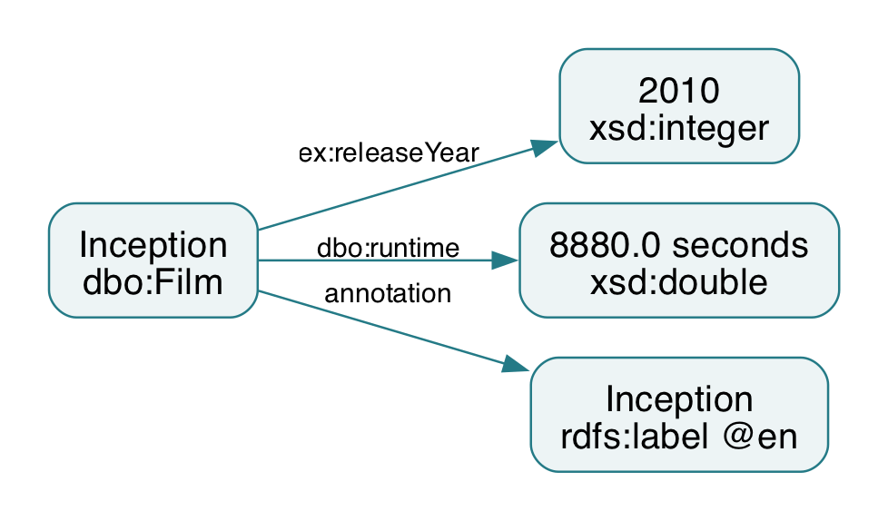
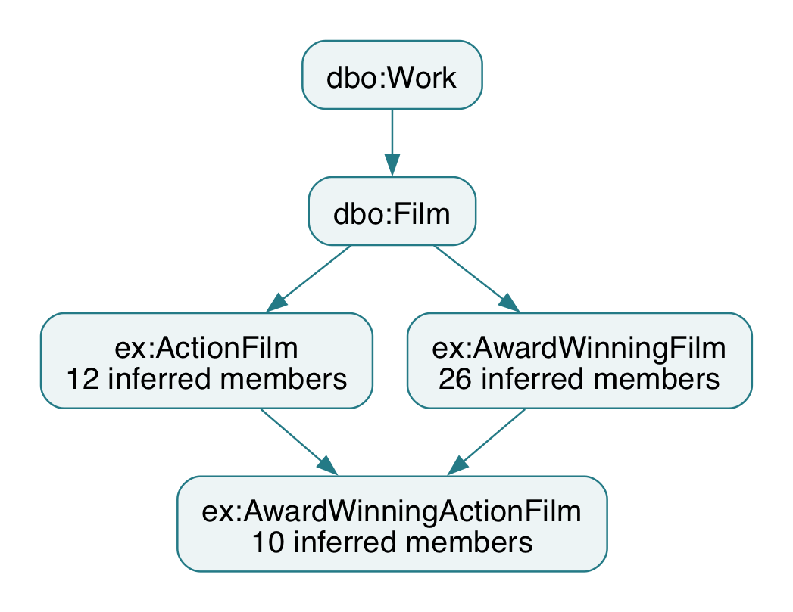
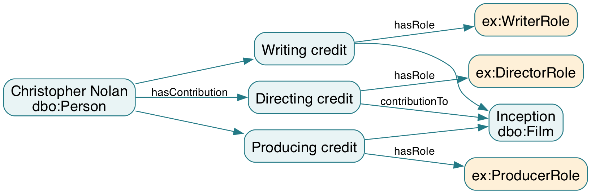
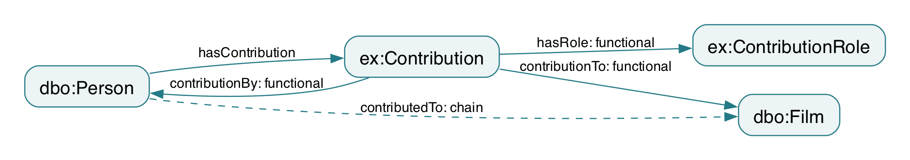
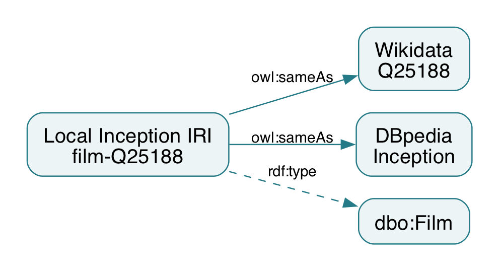
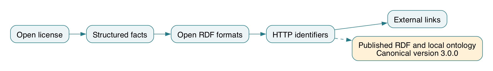
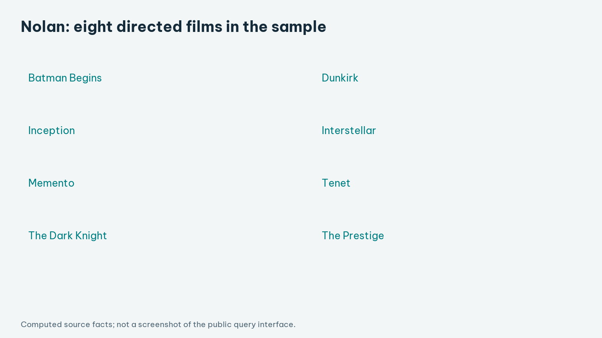
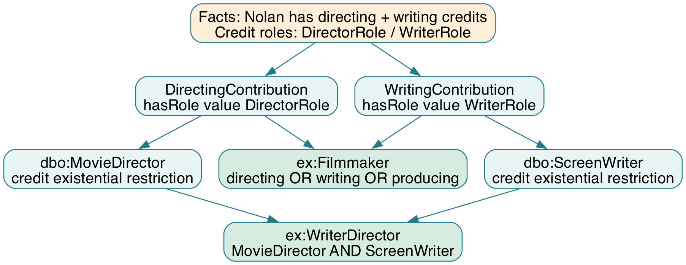
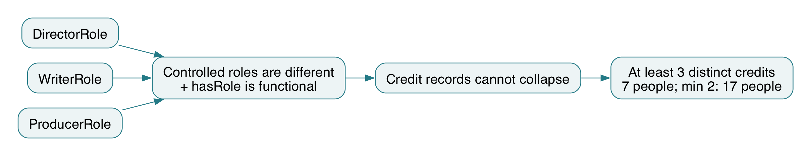

# MovieLOD: course project report (English)

Formatting: Times New Roman 13 pt; 1.5 line spacing; justified body text; A4; left 3 cm, right/top/bottom 2 cm. PDF has 15 pages including cover, contents and references.

## Page 1: Cover

Hanoi University of Science and Technology
Supervisor: TS. Đỗ Bá Lâm
Lã Minh Trung — 20251319M
Nguyễn Thu Uyên — 20252279M
Nguyễn Thị Nhã Linh — 20261262M
Nguyễn Khắc Thái Bình — 20251324M

<!-- page break -->

## Page 2: TABLE OF CONTENTS

1. INTRODUCTION AND OBJECTIVES … 3
  1.1 Abstract and problem statement … 3
  1.2 Research objectives and competency questions … 3
  1.3 Scope and evaluation approach … 3
2. CONCEPTUAL FRAMEWORK … 4
  2.1 From heterogeneous sources to a knowledge graph … 4
  2.2 Representation and interpretation … 4
3. DATA ACQUISITION AND PROVENANCE … 5
4. NORMALIZATION AND RDF GENERATION … 6
5. ONTOLOGY STRUCTURE … 7
6. CONTRIBUTION MODEL … 8
7. PROPERTIES AND OWL CONSTRAINTS … 9
8. PUBLICATION AND FOUR-STAR DATA … 10
9. EXTERNAL IDENTITY LINKS … 11
10. SPARQL AND COMPETENCY QUESTIONS … 12
11. REASONING AND INTERPRETATION … 13
12. EVALUATION AND LIMITATIONS … 14
13. CONCLUSION AND REFERENCES … 15
  13.1 Conclusion and future work … 15
  13.2 References … 15

<!-- page break -->

## Page 3: 1. INTRODUCTION AND OBJECTIVES

### 1.1 Abstract and problem statement

MovieLOD studies how source movie descriptions can be represented as linked knowledge and used for logical classification. The final ontology reuses DBpedia vocabulary and a local Contribution pattern. Its 30-film sample contains 851 people, 1,010 credits, 37 named classes and 1,727 identity links. The complete OWL contains 19,025 triples, including schema and asserted facts. HermiT confirms consistency and source-supported inferred memberships. Inception and Christopher Nolan illustrate overlapping roles and genuine cardinality reasoning. The application exposes the same source facts and precomputed entailments through explicit query scopes.

### 1.2 Research objectives and competency questions

Table 1. Questions guiding ontology design and evaluation.

| ID | Competency question | Knowledge required |
| --- | --- | --- |
| CQ1 | Who directed a film? | Source film–person relation |
| CQ2 | Who holds multiple film roles? | Contribution and controlled roles |
| CQ3 | Which films satisfy genre/award classes? | Existential and intersection definitions |
| CQ4 | Which identifiers refer to the same entity? | Identity and provenance |
| CQ5 | Which memberships are logically entailed? | OWL restrictions and distinctness |

### 1.3 Scope and evaluation approach

The sample is a case study, not a comprehensive catalogue. Evaluation separates assertions, class entailments, relationship materialization and query aggregation. Author-defined genre buckets are grounded in source labels but are not claimed as source-provided taxonomic facts. This separation permits an evidence-based assessment of semantic expressiveness without claiming industry-wide completeness.

<!-- page break -->

## Page 4: 2. CONCEPTUAL FRAMEWORK


### 2.1 From heterogeneous sources to a knowledge graph

The study combines complementary source descriptions through a common conceptual model. Entity alignment identifies which records refer to the same film or person. RDF then expresses the aligned descriptions as relationships and typed values. The ontology supplies a vocabulary and axioms that make these relationships interpretable. Semantic inference adds consequences of the axioms, while SPARQL retrieves both stated and entailed knowledge. Provenance provides a basis for interpreting where each description originated.

Table 2. Distinct knowledge layers used in the study.

| Knowledge layer | Semantic role |
| --- | --- |
| Terminological knowledge (TBox/RBox) | Classes, properties and restrictions |
| Assertional knowledge (ABox) | Individuals, relationships and literal values |
| Entailed knowledge | Consequences of assertions and axioms |

### 2.2 Representation and interpretation

A person may be explicitly typed Person while satisfying Filmmaker through a credit. HermiT infers the type from the model; it is not a new crawled statement. Relationship closure separately applies inverse, subproperty and chain rules. Aggregation over distinct RDF terms is a query operation and cannot establish OWL inequality by itself. Interpretation of results therefore specifies the graph, identity scope and reasoning method.

<!-- page break -->

## Page 5: 3. DATA ACQUISITION AND PROVENANCE

Wikidata entities are resolved through exact English Wikipedia sitelinks. The collector retrieves film claims and the related people, companies, awards and terms. DBpedia matches are accepted only when the resource corresponds to the expected title and is typed as a Film. This conservative rule produces 28 DBpedia film links; missing matches are not guessed [4,5].

Table 3. Main source properties used by the collector.

| Claim group | Wikidata properties |
| --- | --- |
| People and roles | P57 director; P161 cast; P58 writer; P162 producer |
| Film context | P136 genre; P495 country; P364 language |
| Dates, runtime and organizations | P577 release; P2047 runtime; P166 award; P272 company |


Provenance associates an assertion with its source and retrieval context. The corpus contains 76 retained source responses, allowing normalized claims to be traced to their original descriptions. This is important because source content can evolve, and a later response may differ from the one used in the study. Integrity checks establish that a retained response is unchanged; they do not establish that the source claim is true. Provenance, entity matching and semantic validation therefore address different aspects of data quality.

<!-- page break -->

## Page 6: 4. NORMALIZATION AND RDF GENERATION

Source QIDs form stable local identifiers. Credit and context claims map to reused DBpedia properties. Runtime is normalized to seconds, following dbo:runtime and its xsd:double range. The earliest eligible Gregorian P577 year is retained as ex:releaseYear, an explicitly defined summary rather than an invented full release date. Labels reuse rdfs:label. Source snapshots permit each normalized entity or association to be traced to the response used.

```
res:film-Q25188 a dbo:Film ;
  rdfs:label "Inception"@en ;
  ex:releaseYear 2010 ;
  dbo:runtime "8880.0"^^xsd:double ;
  dbo:director res:person-Q25191 .
```



The final RDF/XML graph contains 19,025 triples including asserted data and schema; it does not include the full inference closure. Inception's 8,880 seconds equal the source-normalized 148 minutes. Typed literals distinguish numeric quantities from entity identifiers. The current sample contains 30 films, 851 people, 1,010 credit records, 45 companies and 672 award entities. These are distinct counting units, not interchangeable measures of graph size.

<!-- page break -->

## Page 7: 5. ONTOLOGY STRUCTURE

The final ontology declares 37 named classes: 17 DBpedia classes, one VoID Dataset class and 19 local classes. Reuse includes Film, Work, Person, Actor, Artist, MovieDirector, Writer, ScreenWriter, Producer, Agent, Organisation, Company, Genre, MovieGenre, Award, Country and Language. Local extensions describe credits, provenance, genre buckets and inferred subsets. Reusing these IRIs preserves shared meaning rather than cloning standard concepts under a local namespace.



Table 4. Groups totaling 37 named classes.

| Class group | Declarations |
| --- | --- |
| DBpedia / VoID classes | 17 / 1 |
| Contribution / role / source; credit subclasses | 3; 4 |
| Genre buckets; domain inferred subsets | 2; 10 |

Unsupported feature-film assertions and empty documentary classes are excluded. Genre buckets ActionGenre and DramaGenre reflect transparent label mappings. No fiction hierarchy or fallback FilmAward class is guessed. Ten domain subsets have inferred members, including seven additions beyond Filmmaker, ActionFilm and AwardWinningFilm; four role-defined credit classes support their multi-step explanations.

<!-- page break -->

## Page 8: 6. CONTRIBUTION MODEL

Contribution represents a contextual person–film–role association. Functional contributionBy, contributionTo and hasRole identify its three endpoints and qualified exactly-one restrictions characterize the record. DirectorRole, ActorRole, WriterRole and ProducerRole are controlled individuals, not people or role subclasses. Nolan's three roles on Inception are three credit records. Credit subclasses are inferred through hasRole value restrictions; occupation-level inferences reuse DBpedia classes without redefining their global meaning.



Table 5. Role distribution returned by the full Inception query.

| Inception role | Contribution records |
| --- | --- |
| Actor | 21 |
| Director / Writer / Producer | 1 / 1 / 2 |
| Total | 25 |

The contribution node represents a ternary association through three binary relations. Compared with a direct director or starring edge, it makes the person–film–role context explicit and permits association-level provenance. The additional nodes increase representation size but support extensions such as credit order or role-specific dates. Inverse relationships enable navigation from either a person or a film. The 1,010 contribution records must therefore be interpreted as contextual associations, not 1,010 distinct people.

<!-- page break -->

## Page 9: 7. PROPERTIES AND OWL CONSTRAINTS

The model declares 19 object and five datatype properties. Standard film relations reuse director, starring, writer, producer, productionCompany, award, genre, country and language. Custom relations encode the local credit context. contributionBy, contributionTo and hasRole are functional; their qualified cardinalities are exactly one. contributedTo follows from the chain hasContribution followed by contributionTo. Inverse and subproperty rules also support navigation and broader relationship retrieval.



Table 6. Five declared datatype properties; rdfs:label is an annotation.

| Datatype property | Datatype / meaning |
| --- | --- |
| dbo:runtime | xsd:double / seconds |
| ex:releaseYear; ex:sha256 | xsd:integer; xsd:string |
| ex:sourceUrl; ex:retrievedAt | xsd:anyURI; xsd:dateTime |

Domain and range support type entailment, not missing-field validation. In particular, starring has range Actor and gives Actor membership without an ex:Actor clone. OWL does not assume that different identifiers denote different individuals. Minimum cardinality uses the simple hasContribution relation, not the non-simple chain property contributedTo. These design choices preserve the distinction between semantic constraints and application validation [1].

<!-- page break -->

## Page 10: 8. PUBLICATION AND FOUR-STAR DATA

HTTP IRIs, open RDF representations and a CC BY-SA 4.0 data license support linked-data exchange [3]. The published application distributes the canonical DBpedia-based source graph, ontology and inference exports. Resource descriptions retain machine-readable links. Graph equivalence checks compare public RDF with the local exports; logical classification and HTTP access are evaluated separately.



Resource descriptions connect identifiers with types, labels, relations and provenance. Standard RDF permits consumers to interpret these statements independently of the original interface. Following links can reveal connected people, genres, companies and awards. Human-readable pages and machine-readable RDF support complementary audiences, while source and identity assertions serve different semantic purposes.

The academic significance of publication is interoperability, supported by useful identifiers, vocabulary semantics and reuse conditions. Accessibility alone does not establish factual accuracy or logical consistency. Evaluation must therefore identify the graph version and the evidence supporting each claim. The local revision retains the source identity links while changing duplicate vocabulary and inference definitions.

<!-- page break -->

## Page 11: 9. EXTERNAL IDENTITY LINKS

Entity alignment yields 1,699 Wikidata and 28 DBpedia owl:sameAs statements, totaling 1,727 identity links. These concern films, people and related entities; the film-only query returns 58 links. Matching combines identifiers, exact title associations and compatible entity types. This conservative approach prioritizes justified identity assertions over maximizing the number of links.



```
res:film-Q25188 owl:sameAs
  <http://www.wikidata.org/entity/Q25188>,
  <http://dbpedia.org/resource/Inception> .
```

sameAs means that identifiers denote one entity. It is different from reusing dbo:Film as vocabulary or associating a source snapshot. Identity inference can propagate descriptions across aliases, so counting local IRIs avoids inflating populations with external names. Entity alignment is supported by identifiers and matching evidence, not name similarity alone. Incorrect identity assertions could propagate unrelated facts and must be reviewed.

Table 7. Link counts and their scopes.

| Measure | Recorded result |
| --- | --- |
| All identity links | 1,727 |
| Wikidata / DBpedia links | 1,699 / 28 |
| Film-only link query | 58 rows |

<!-- page break -->

## Page 12: 10. SPARQL AND COMPETENCY QUESTIONS

SPARQL operationalizes competency questions through graph patterns. SELECT returns bindings, ASK checks pattern solutions and CONSTRUCT creates a graph [2]. The final design has 27 executed questions spanning direct facts, hierarchy and inferred knowledge. The graph scope is explicit: asserted data for direct questions, schema and inferred results for class queries, and named graphs for before/after comparisons. No query implicitly starts a DL reasoner.



Table 8. Source and inference queries have different scopes.

| Question | Verified result |
| --- | --- |
| Inception year / runtime / director | 2010 / 8,880 s / Christopher Nolan |
| Nolan films; Inception credits | 8 films; 25 records |
| WriterDirector before / after | 0 / 10 local people |

WriterDirector is absent as an asserted type but has ten reasoned members. Nolan's ThreeCreditContributor ASK changes from false on assertions to true on the reasoned graph; false is query absence, not OWL negation. Local namespace filters exclude identity aliases, and LIMIT would restrict displayed solutions rather than class population. These conventions make before/after evidence interpretable and reproducible.

<!-- page break -->

## Page 13: 11. REASONING AND INTERPRETATION

HermiT classified the exact final RDF/XML ontology and found it consistent, with no unsatisfiable named classes. The file hash binds the result to the inspected ontology. Membership counts match the verified design. Logical consistency does not prove completeness or factual correctness. Relationship closure separately materializes inverse, subproperty and property-chain entailments, producing 965 local person–film pairs.



Table 9. HermiT membership counts; these subset types are not asserted.

| Inferred subset | Local members |
| --- | --- |
| dbo:Actor; Filmmaker; WriterDirector | 769; 89; 10 |
| MultiCreditContributor; ThreeCreditContributor | 17; 7 |
| ActionFilm; AwardWinningFilm; their intersection | 12; 26; 10 |
| ActorFilmmaker; AwardWinningFilmmaker; GenreCrossingFilm | 7; 65; 8 |

Nolan's three different-role credits cannot collapse into one individual: hasRole is functional and the controlled roles are different. This supplies genuine minimum-cardinality witnesses. In contrast, two genre IRIs alone do not establish inequality; the separate MultiGenreFilm test produces zero DL members. Distinct-term counting and cardinality entailment remain different claims, not conflicting classifications.

<!-- page break -->

## Page 14: 12. EVALUATION AND LIMITATIONS

Evaluation considers source support, conceptual coherence, logical consistency and competency-query coverage. All 30 sampled films have a director, duration and release-year summary. Credit records preserve overlapping roles; inferred subsets follow explicit definitions. Seventeen people satisfy a two-credit lower bound and seven a three-credit bound. These observations demonstrate model capabilities within the selected corpus, not population-wide completeness.



Table 10. Academic evaluation and limits.

| Dimension | Observation | Interpretation |
| --- | --- | --- |
| Source coverage | 30-film selected sample | Local scope, not an industry census |
| Consistency | HermiT passed; no unsatisfiable classes | No detected logical contradiction |
| Entailment | 27 queries; before/after types | New knowledge is traceable |
| Identity / labels | No annotated reference set | No claimed precision or recall |

Selection bias, source errors and label-based genre mapping limit external validity. Identity alignment lacks an independently annotated ground truth, so matching precision and recall are not claimed. OWL's open-world semantics permits incomplete information. Future work should separately assess source accuracy, identity quality and sensitivity to modeling choices; the deployed graphs are checked against the canonical exports.

<!-- page break -->

## Page 15: 13. CONCLUSION AND REFERENCES

### 13.1 Conclusion and future work

The study demonstrates DBpedia reuse with a source-grounded credit model. Hierarchy, restrictions, intersections, inverses and a property chain expose consequences beyond assertions. Seven additional domain subsets have inferred members. Role-based distinctness supports genuine cardinality, while the negative genre test shows why identifier counts are not OWL entailments.

Future work should use a broader sample, expert-reviewed genre mappings and annotated identity matches. Provenance-aware reconciliation could address conflicting descriptions. Richer models might distinguish works, releases and editions. Future publication changes should preserve vocabulary semantics, graph scopes and units.

### 13.2 References

[1] W3C. OWL 2 Web Ontology Language Primer, Second Edition. 2012. https://www.w3.org/TR/owl2-primer/

[2] W3C. SPARQL 1.1 Query Language. 2013. https://www.w3.org/TR/sparql11-query/

[3] Tim Berners-Lee. Linked Data — Design Issues. W3C. https://www.w3.org/DesignIssues/LinkedData.html

[4] Wikidata. Data access. https://www.wikidata.org/wiki/Wikidata:Data_access

[5] DBpedia Association. SPARQL over Online Databases. https://www.dbpedia.org/resources/sparql/

[6] W3C. RDF 1.1 Concepts and Abstract Syntax. 2014. https://www.w3.org/TR/rdf11-concepts/

References accessed 9 October 2026. Figure captions identify source illustrations and author diagrams.

<!-- page break -->
