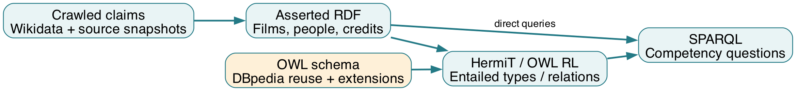

# 1. Bắt đầu từ câu hỏi nghiên cứu

Project dùng dữ liệu phim để trả lời hai loại câu hỏi. Loại thứ nhất đọc trực tiếp thông tin đã thu thập: Inception do ai đạo diễn, có diễn viên nào, được sản xuất ở đâu và dài bao nhiêu giây. Loại thứ hai hỏi kiến thức chưa được gán thành nhãn trong dữ liệu đầu vào: ai là Filmmaker, ai vừa là đạo diễn vừa là biên kịch, ai có ít nhất ba Contribution khác nhau, phim hành động nào đã nhận giải thưởng.

Phần học thuật nằm ở việc mô tả rõ các khái niệm, tái sử dụng vocabulary chuẩn, định nghĩa điều kiện phân loại và kiểm tra những kết luận mà ontology cho phép suy ra. Website là một giao diện khai thác dữ liệu; nó không tự thay thế ontology hoặc reasoner.

**Có thể giới thiệu project bằng đoạn sau:** “MovieLOD xây dựng một knowledge graph từ dữ liệu phim đã thu thập. Chúng tôi reuse DBpedia cho các khái niệm phổ biến, bổ sung mô hình Contribution để biểu diễn vai trò của người tham gia, dùng OWL để suy luận kiến thức mới và dùng SPARQL để kiểm tra các câu hỏi năng lực.”

## 1.1. Phạm vi tài liệu và phiên bản cần đọc

Tài liệu này giải thích **ontology 3.0.0 trong `ontology/Movie_Knowledge_Graph.owl`**. Đây là file đầy đủ để mở trong Protégé. File `Movie_Ontology.owl` chỉ chứa schema, nên mở riêng file đó sẽ không thấy đầy đủ các phim và người.

Ontology, dataset ứng dụng, các scope truy vấn và tài liệu đều dùng bản 3.0.0. Bản cũ có ex:Actor hoặc ex:hasGenre đã được thay bằng dbo:Actor và dbo:genre. Bộ build hiện xuất lại model mới nhất. MP4 đã được xóa theo yêu cầu; minh chứng dùng ảnh, log và demo trực tiếp.

## 1.2. Ba cách đọc

| Mục tiêu | Các phần nên đọc trước | Sau khi đọc cần làm được |
|---|---|---|
| Hiểu để thuyết trình | 1–6, 8–10, 14 | Kể được dữ liệu → mô hình → quy tắc → kiến thức mới |
| Tự kiểm tra trong Protégé | 3–10, 12 | Tìm đúng cá thể, đọc restriction và xem inferred types |
| Hiểu truy vấn và mã xử lý | 7–8, 11, 13, phụ lục | Chọn đúng graph, chạy query và phân biệt các công cụ |

# 2. Bức tranh tổng thể của project

{width=15cm}

Các bước có vai trò khác nhau:

1. **Thu thập:** lấy các claim và nhãn thực thể từ dữ liệu Wikidata đã crawl; sử dụng DBpedia để kiểm tra vocabulary và liên kết phim.
2. **Chuẩn hóa:** chọn giá trị theo chính sách rõ ràng, đổi đơn vị thời lượng, tạo IRI và ghi xuất xứ.
3. **Mô hình hóa:** biểu diễn phim, người, thể loại, giải thưởng, công ty và Contribution bằng RDF; định nghĩa schema bằng OWL.
4. **Suy luận:** dùng các tiên đề để suy ra membership và quan hệ. Reasoner không tự đọc Wikipedia để bổ sung các thông tin thiếu.
5. **Truy vấn:** SPARQL đặt câu hỏi trên graph đã chọn. Nếu graph chưa có hoặc chưa tính entailment, query về inferred class có thể trả 0.

**Ví dụ xuyên suốt:** nguồn có claim Nolan là đạo diễn/biên kịch/nhà sản xuất của Inception. Dữ liệu biểu diễn ba credit record với ba role. Ontology định nghĩa các loại Contribution và điều kiện Filmmaker. Reasoner suy ra Nolan thuộc Filmmaker, WriterDirector và ThreeCreditContributor; người đọc kiểm tra các type này bằng Protégé hoặc graph kết quả suy luận.

# 3. Các khái niệm nền: RDF, IRI và literal

## 3.1. Đọc một triple như một câu

RDF biểu diễn thông tin bằng ba thành phần: subject, predicate, object. Object có thể là một thực thể hoặc một literal. IRI định danh đối tượng/quan hệ; literal biểu diễn giá trị như số hoặc chuỗi. Turtle và RDF/XML là hai cách ghi graph RDF ra file, không phải hai mô hình kiến thức khác nhau. [W3C RDF Primer](https://www.w3.org/TR/rdf11-primer/)

Trong project, câu “Inception có đạo diễn là Christopher Nolan” được ghi:

```turtle
res:film-Q25188 dbo:director res:person-Q25191 .
```

Đọc từ trái sang phải:

| Thành phần | Giá trị | Nghĩa trong câu |
|---|---|---|
| Subject | `res:film-Q25188` | Cá thể Inception |
| Predicate | `dbo:director` | Quan hệ phim → đạo diễn |
| Object | `res:person-Q25191` | Cá thể Christopher Nolan |

Câu về thời lượng có object là literal:

```turtle
res:film-Q25188 dbo:runtime "8880.0"^^xsd:double .
```

`8880.0` là giá trị; `xsd:double` là datatype. Trong OWL 3.0.0, đơn vị của `dbo:runtime` là **giây**, nên Inception có 8.880 giây, tương đương 148 phút. Không so trực tiếp con số 8.880 này với trường phút của ứng dụng cũ.

## 3.2. Prefix là viết tắt, không phải một thực thể mới

Các ví dụ trong tài liệu dùng:

```turtle
@prefix dbo: <http://dbpedia.org/ontology/> .
@prefix ex: <https://movie-lod-semantic-web.laminhtrung2001.chatgpt.site/ontology#> .
@prefix res: <https://movie-lod-semantic-web.laminhtrung2001.chatgpt.site/resource/> .
@prefix rdf: <http://www.w3.org/1999/02/22-rdf-syntax-ns#> .
@prefix rdfs: <http://www.w3.org/2000/01/rdf-schema#> .
@prefix owl: <http://www.w3.org/2002/07/owl#> .
@prefix xsd: <http://www.w3.org/2001/XMLSchema#> .
```

`dbo:Film` là một IRI thuộc vocabulary DBpedia. `res:film-Q25188` là IRI cá thể phim của project. Hai chuỗi cùng chứa từ “film” nhưng có vai trò khác nhau.

## 3.3. Cú pháp thường gặp khi xem Turtle

| Ký hiệu | Cách đọc trong project |
|---|---|
| `a` | Viết tắt của `rdf:type` |
| `;` | Tiếp tục khai báo predicate khác cho cùng subject |
| `,` | Thêm object cho cùng subject/predicate |
| `.` | Kết thúc nhóm khai báo |
| `"Inception"@en` | Chuỗi có nhãn ngôn ngữ tiếng Anh |
| `^^xsd:integer` | Giá trị có datatype integer |
| `[ ... ]` / blank node | Một node không có IRI riêng; thường dùng ghi restriction hoặc biểu thức lớp |

Không cần học thuộc mọi blank node trong RDF/XML. Khi mở Protégé, nên đọc các biểu thức restriction tương ứng để hiểu ý nghĩa.

# 4. Ontology, knowledge graph, class và individual

## 4.1. Phân biệt bản thiết kế với dữ liệu cụ thể

Trong project, **ontology** mô tả class, property và tiên đề; **knowledge graph** chứa các cá thể, quan hệ và giá trị cụ thể, kết hợp với schema để khai thác ngữ nghĩa. File OWL đầy đủ chứa cả hai phần. Có thể phân biệt bằng ba nhóm thuật ngữ học thuật:

| Nhóm | Đọc như thế nào? | Ví dụ của MovieLOD |
|---|---|---|
| TBox | Kiến thức về lớp | Actor là subclass của Artist; Filmmaker có định nghĩa bằng restriction |
| RBox | Kiến thức về quan hệ | contributionBy inverseOf hasContribution; property chain tạo contributedTo |
| ABox | Kiến thức về cá thể | Inception có director Nolan; một Contribution có DirectorRole |

Đây là cách chia nội dung để giải thích, không nhất thiết là ba file độc lập.

## 4.2. Class không phải individual

```turtle
dbo:Film a owl:Class .
res:film-Q25188 a dbo:Film .
```

Dòng đầu nói Film là lớp; dòng sau nói Inception là cá thể thuộc lớp Film. “ActionFilm là một lớp” khác với “Inception thuộc ActionFilm”. Trước reasoning, cá thể phim có thể chỉ có type Film; sau reasoning, có thêm type ActionFilm nếu các điều kiện được thỏa mãn.

Trong model này, **ActorRole là individual thuộc ContributionRole**, không phải subclass của Person. Một role mô tả vai trò của credit record; nó không tự là một người diễn viên.

## 4.3. Hierarchy là quan hệ bao hàm

Ví dụ reuse từ DBpedia trong module:

```text
Actor ⊑ Artist ⊑ Person ⊑ Agent
Company ⊑ Organisation ⊑ Agent
Film ⊑ Work
MovieGenre ⊑ Genre
```

Dấu `⊑` đọc là “là lớp con của”. Nếu một người được suy ra là Actor, người đó cũng thuộc các lớp cha trong chuỗi. Hierarchy không có nghĩa rằng Actor chỉ được phép có đúng một nghề; một người vẫn có thể thuộc nhiều lớp.

# 5. Vì sao reuse DBpedia?

## 5.1. Reuse nghĩa là dùng đúng IRI và đúng ngữ nghĩa

MovieLOD dùng trực tiếp `dbo:Film`, `dbo:Person`, `dbo:Actor`, `dbo:Company`, `dbo:Award`, `dbo:MovieGenre`, `dbo:Country` và `dbo:Language`. Quan hệ phổ biến dùng `dbo:director`, `dbo:starring`, `dbo:writer`, `dbo:producer`, `dbo:productionCompany`, `dbo:award`, `dbo:genre`, `dbo:country`, `dbo:language`.

Không chỉ thay tiền tố `ex:` thành `dbo:` rồi giữ nguyên mọi giả định. Phải kiểm tra chiều quan hệ, domain, range, datatype và đơn vị. Ví dụ, `dbo:starring` có domain Work và range Actor; `dbo:runtime` dùng giây và `xsd:double`. [DBpedia starring](https://dbpedia.org/ontology/starring), [DBpedia runtime](https://dbpedia.org/ontology/runtime)

## 5.2. Reuse class và liên kết individual là hai việc khác nhau

- `res:film-Q25188 a dbo:Film`: reuse vocabulary để phân loại một phim.
- `res:film-Q25188 owl:sameAs <http://www.wikidata.org/entity/Q25188>`: khẳng định hai IRI nói đến cùng cá thể.

Reuse `dbo:Film` không có nghĩa toàn bộ dữ liệu phim được lấy từ DBpedia. Phải nhìn provenance để biết dữ liệu của từng phát biểu xuất phát từ đâu.

## 5.3. Khi nào tạo extension riêng?

Các custom class cần mô tả ý nghĩa mà lớp nền chưa thể hiện: Contribution là credit record; DirectingContribution là credit với role đạo diễn; WriterDirector là người thỏa cả hai nhóm điều kiện trong mẫu dữ liệu; AwardWinningActionFilm kết hợp điều kiện thể loại và giải thưởng.

`ex:Filmmaker` trong project là tập người có credit đạo diễn, biên kịch hoặc nhà sản xuất trong dữ liệu đã thu thập. Nó không thay thế định nghĩa nghề nghiệp toàn cầu của DBpedia. `dbo:MovieDirector` chỉ mô tả nhánh đạo diễn và được reuse cho suy luận nghề tương ứng.

Nguyên tắc đọc: **khái niệm nền dùng chung → reuse; subset có nghĩa riêng và có dữ liệu hỗ trợ → extension; cấu trúc credit riêng → custom model**.

# 6. Dữ liệu thực tế và cách đọc các con số

## 6.1. Các trường nguồn làm căn cứ

| Claim / metadata | Nội dung đã thu thập | Biểu diễn trong model 3.0.0 |
|---|---|---|
| P31 | Instance of | Film; kiểm tra human Q5 cho Person |
| P57 | Director | dbo:director và credit DirectorRole |
| P161 | Cast member | dbo:starring và credit ActorRole |
| P58 | Screenwriter | dbo:writer và credit WriterRole |
| P162 | Producer | dbo:producer và credit ProducerRole |
| P136 | Genre | dbo:genre → dbo:MovieGenre |
| P272 | Production company | dbo:productionCompany → dbo:Company |
| P166 | Award received | dbo:award → dbo:Award |
| P495 / P364 | Country of origin / language | dbo:country / dbo:language |
| P2047 | Duration | Đổi đơn vị thành giây cho dbo:runtime |
| P577 | Publication/release time | ex:releaseYear: năm Gregorian sớm nhất theo chính sách chọn giá trị |
| URL, retrieval time, SHA-256 | Metadata phản hồi crawl | SourceSnapshot và provenance |

Không có trường budget, gross, IMDb ID hoặc ratings trong tập field đã crawl của project này; không trình bày chúng như dữ liệu đã được bổ sung. Năm 2010 được giữ ở mức năm; không tự biến thành ngày 01/01/2010 khi nguồn không cung cấp độ chính xác đó.

## 6.2. Quy mô của file OWL cuối

| Chỉ tiêu | Giá trị | Cách hiểu |
|---|---:|---|
| Phim / người | 30 / 851 | Mẫu phim có chủ đích và người liên quan |
| Contribution | 1.010 | Record theo bộ phim–người–role |
| Công ty / genre / award | 45 / 75 / 672 | Các thực thể đã có trong dữ liệu |
| Quốc gia / ngôn ngữ | 11 / 15 | Thực thể được tham chiếu từ phim |
| SourceSnapshot | 76 | Phản hồi nguồn có metadata |
| Lớp có tên | 37 | Không đếm anonymous class expression là lớp có tên |
| Object / datatype property | 19 / 5 | Không tính mọi annotation/built-in predicate vào hai nhóm này |
| Triple trong OWL đầy đủ | 19.025 | Bao gồm schema và dữ liệu khai báo; chưa thêm toàn bộ closure suy luận |
| Role individual | 4 | DirectorRole, ActorRole, WriterRole, ProducerRole |

**Lưu ý về phạm vi đếm:** các kết quả classification được thống kê theo IRI `res:` để tránh tính lại alias Wikidata/DBpedia. Bốn role nằm dưới `ex:`, nên số 0 ở hàng ContributionRole trong báo cáo chỉ đếm `res:` không có nghĩa ontology không có role. Khi báo cáo tổng số role, đếm cả bốn individual `ex:*Role`.

Nguồn số liệu: file OWL cuối và `evidence/ontology_design/final_owl_checks.json`. Dataset nguồn có 18.595 triple; schema 442 triple; full OWL có 19.025 triple do một số role triples xuất hiện ở cả hai graph.

# 7. Contribution: phần mô hình hóa quan trọng nhất

## 7.1. Vì sao không chỉ dùng một cạnh phim–người?

Cạnh `Inception dbo:director Nolan` đủ để trả lời ai là đạo diễn. Tuy nhiên, một người có nhiều role, trên nhiều phim, và mỗi credit cần có nguồn. Contribution tạo một record trung gian gắn **một người, một phim và một role**. Record này cũng có thể mang provenance.

Trong graph, Nolan có 22 IRI credit record thuộc các phim trong mẫu, và có credit đạo diễn trên 8 phim. Con số 22 là số record định danh trong dữ liệu, không tự là chứng minh OWL rằng có 22 cá thể credit khác nhau. Ta sẽ dùng ba role khác nhau để chứng minh chắc chắn lower bound trong phần cardinality.

{width=15cm}

## 7.2. Đọc một record thực tế

```turtle
res:person-Q25191 a dbo:Person ;
    ex:hasContribution res:contribution-Q25188-Q25191-director .

res:contribution-Q25188-Q25191-director
    a ex:Contribution ;
    ex:contributionBy res:person-Q25191 ;
    ex:contributionTo res:film-Q25188 ;
    ex:hasRole ex:DirectorRole .
```

Có thể suy ra loại record:

```text
DirectingContribution EquivalentTo:
    Contribution and (hasRole value DirectorRole)
```

Record đầu vào chỉ được khai báo Contribution. Type DirectingContribution là kết quả của định nghĩa OWL, không phải một nhãn người viết thêm để giả lập reasoning.

## 7.3. Person, role và credit không được đánh đồng

| Đối tượng | Ví dụ | Loại |
|---|---|---|
| Person | Christopher Nolan | dbo:Person |
| Role | DirectorRole | ex:ContributionRole individual |
| Credit record | contribution-Q25188-Q25191-director | ex:Contribution; suy ra DirectingContribution |
| Film | Inception | dbo:Film |

Ba record đạo diễn, biên kịch và nhà sản xuất của Nolan trên Inception có thể tồn tại đồng thời. Không cần gán Nolan vào một class tổ hợp thủ công hoặc coi ba role là ba người khác nhau.

# 8. Đọc object property và các tiên đề quan hệ

## 8.1. Domain/range là tiên đề suy luận, không phải form validation

Với `dbo:starring`, một triple có chủ thể là work và đối tượng là actor theo domain/range của property. Domain/range có thể giúp suy ra type của hai đầu quan hệ; không nên đọc chúng như điều kiện lọc bỏ mọi triple có endpoint chưa được gán type. [W3C RDF Schema](https://www.w3.org/TR/rdf-schema/)

Ví dụ, nếu dữ liệu có `Film dbo:starring Person`, reasoner có thể suy ra Person thuộc `dbo:Actor`. Bản 3.0.0 sử dụng đúng range đã có của DBpedia và hierarchy Actor → Artist → Person → Agent; không định nghĩa lại Actor bằng một equivalent class riêng.

Nếu một endpoint vốn được khai báo thuộc một class không tương thích và ontology có disjointness liên quan, việc suy ra thêm type có thể dẫn đến inconsistency. Domain/range tự nó không phải một báo cáo “thiếu trường” như hệ thống nhập liệu.

## 8.2. Inverse: đọc cùng quan hệ theo chiều ngược lại

```text
contributionBy inverseOf hasContribution
contributionTo inverseOf contributionOf
ex:directed inverseOf dbo:director
```

Từ credit `contributionBy Nolan`, suy ra `Nolan hasContribution credit`. Từ `Inception director Nolan`, suy ra `Nolan directed Inception`. Hai chiều thể hiện cùng liên kết nhưng đổi vị trí subject/object.

## 8.3. Subproperty: quan hệ cụ thể nằm trong quan hệ rộng hơn

`ex:directed subPropertyOf ex:contributedTo` có nghĩa: nếu Nolan directed một phim thì Nolan contributedTo phim đó. Chiều ngược lại không đúng: biết contributedTo không đủ kết luận người đó là đạo diễn vì còn có thể là diễn viên, biên kịch hoặc nhà sản xuất.

## 8.4. Property chain: nối các quan hệ theo đúng thứ tự

```text
hasContribution o contributionTo → contributedTo
```

Từ `Nolan hasContribution credit` và `credit contributionTo Inception`, suy ra `Nolan contributedTo Inception`. Ký hiệu `o` là phép hợp thành quan hệ, không phải một property mới.

Bản kiểm thử đã xác nhận **965 cặp người–phim** được materialize bằng inverse/subproperty/chain rules. Đây là số cặp, không phải số Contribution: nhiều role của cùng một người trên cùng phim vẫn có thể tạo một cặp người–phim.

## 8.5. Functional không có nghĩa “ô này bắt buộc điền”

`hasRole`, `contributionBy`, `contributionTo` là functional trong credit model. Nếu cùng một record có hai endpoint qua cùng property, OWL có thể buộc hai endpoint đồng nhất. Nếu chúng được chứng minh là khác nhau, ontology có thể trở nên inconsistent. Không được mặc định rằng reasoner sẽ báo lỗi ngay chỉ vì một record được ghi bằng hai IRI endpoint khác nhau.

`hasContribution` không bị giới hạn chỉ một credit cho mỗi người. Cardinality không đặt trên `contributedTo` vì đó là quan hệ non-simple do property chain; trong mô hình này, các restriction số lượng đặt trên quan hệ đơn giản `hasContribution`.

# 9. Đọc OWL restriction và equivalent class

## 9.1. Từ khóa và chiều kết luận

Manchester Syntax là cách hiển thị biểu thức lớp dễ đọc. Các từ khóa cơ bản trong project là `and`, `or`, `some`, `value`, `min`, `exactly`. EquivalentTo định nghĩa điều kiện cần và đủ; SubClassOf chỉ đưa ra một chiều bao hàm. OWL cũng có `only` để giới hạn loại filler, nhưng không phải mọi keyword đều được dùng trong ontology cuối. [W3C OWL Structural Specification](https://www.w3.org/TR/owl2-syntax/)

| Biểu thức | Cách đọc với ví dụ project |
|---|---|
| `Person and ...` | Phải thỏa Person và điều kiện phía sau |
| `A or B` | Thỏa A hoặc B; có thể thỏa cả hai |
| `hasContribution some DirectingContribution` | Có ít nhất một credit thuộc DirectingContribution |
| `hasRole value DirectorRole` | Có liên kết hasRole đến đúng role individual này |
| `hasContribution min 3 Contribution` | Có ít nhất ba filler Contribution thực sự khác nhau |
| `contributionTo exactly 1 Film` | Chính xác một filler thuộc Film cho endpoint của credit |

## 9.2. Filmmaker: hợp của ba loại credit

```text
Filmmaker EquivalentTo:
    dbo:Person and (
        hasContribution some DirectingContribution
        or hasContribution some WritingContribution
        or hasContribution some ProducingContribution
    )
```

Nolan thỏa nhánh directing; cũng có writing và producing credit. Có nhiều nhánh thỏa điều kiện không tạo ra nhiều Nolan. Ngược lại, một người chỉ có acting credit không tự trở thành Filmmaker theo định nghĩa riêng của project.

## 9.3. WriterDirector: giao của hai nghề được suy ra

```text
WriterDirector EquivalentTo:
    dbo:MovieDirector and dbo:ScreenWriter
```

Từ credit directing, restriction một chiều suy ra nghề `dbo:MovieDirector`. Từ credit writing, suy ra `dbo:ScreenWriter`. Nếu cùng người thỏa cả hai, suy ra WriterDirector. Không gán trực tiếp type WriterDirector vào dữ liệu crawl.

## 9.4. GenreCrossingFilm không thay thế MultiGenreFilm

GenreCrossingFilm trong project yêu cầu có genre thỏa ActionGenre và có genre thỏa DramaGenre. Một genre hybrid có thể thỏa cả hai bucket; do đó biểu thức này không tự chứng minh có hai genre individual khác nhau. Đó là lý do không dùng nó làm bằng chứng trá hình cho cardinality `min 2 genre`.

## 9.5. Class dựa trên award có giới hạn gì?

AwardWinningFilm yêu cầu Film có `dbo:award` đến một Award. AwardWinningFilmmaker yêu cầu Filmmaker có award. Điều này chỉ phản ánh claim award đã thu thập; không tự chứng minh mọi award của một người là giải điện ảnh, giải có uy tín ngang nhau hoặc đạt được vì một phim cụ thể.

# 10. Reasoner, thế giới mở và cardinality

## 10.1. Reasoner suy ra điều đã được tiên đề cho phép

HermiT đọc các assertion và tiên đề OWL, kiểm tra tính nhất quán, phân loại class và suy ra type của individual. Một ontology consistent chưa chứng minh rằng nó đầy đủ hoặc mọi dữ kiện đều đúng ngoài đời. Quy tắc và dữ liệu đầu vào vẫn cần đánh giá chất lượng. [W3C OWL Primer](https://www.w3.org/TR/owl2-primer/)

Trong lần kiểm tra file cuối, HermiT chạy thành công, không tìm thấy named class bất khả thỏa và kết quả membership khớp bản đã kiểm chứng.

{width=15cm}

## 10.2. Asserted khác inferred

- Asserted: đầu vào ghi `credit a Contribution` và `credit hasRole DirectorRole`.
- Inferred: reasoner kết luận credit thuộc DirectingContribution và người sở hữu credit thỏa các class liên quan.

Protégé có thể hiển thị inferred type mà chưa ghi nó thành assertion trong file OWL. Vì vậy, đóng/mở một OWL chỉ chứa facts và schema vẫn cần chạy reasoner. File `inferred.ttl` là kết quả export để truy vấn, không phải bằng chứng rằng dữ liệu đầu vào đã gán những type đó.

## 10.3. Open World Assumption

OWL không mặc định rằng graph đã liệt kê mọi phát biểu đúng. Không thấy award trong graph không đủ kết luận cá thể chắc chắn chưa từng nhận giải. Không thấy credit thứ tư không đủ kết luận cá thể chỉ có ba credit. Không thấy quan hệ trong một query cũng có thể chỉ là do chọn sai graph hoặc chưa thực hiện entailment.

Một restriction `exactly 1` có thể được thỏa bởi filler chưa được ghi rõ. Vì thế, cần kiểm tra cấu trúc dữ liệu riêng nếu muốn phát hiện record thiếu person/film/role. Đây là bài toán validation, khác với consistency reasoning.

## 10.4. OWL không có Unique Name Assumption

Hai IRI khác nhau có thể cùng chỉ một cá thể. Minimum cardinality cần các filler khác nhau về mặt ngữ nghĩa, không chỉ khác chuỗi IRI. Identity và inequality là một phần của ngữ nghĩa OWL. [W3C OWL Direct Semantics](https://www.w3.org/TR/owl2-direct-semantics/)

Dữ liệu có hai genre QID khác nhau và SPARQL đếm được hai IRI không tự chứng minh `min 2 genre`. Bản kiểm thử MultiGenreFilm đã trả **0 cá thể được HermiT suy ra**. Không thêm blanket AllDifferent cho genre/award/film chỉ để làm tăng số kết quả.

## 10.5. Vì sao min 3 Contribution của Nolan suy ra được?

Nolan có ba credit trên Inception: directing, writing, producing. Mỗi credit trỏ đến một role khác nhau. Các role được thiết kế là các giá trị khác nhau của vocabulary kiểm soát và có AllDifferent; hasRole là functional.

Nếu hai credit là cùng một cá thể, cá thể đó phải có hai role khác nhau qua cùng functional property, dẫn đến mâu thuẫn. Vì vậy, ba credit đó không thể đồng nhất. HermiT có đủ căn cứ kết luận có ít nhất ba Contribution khác nhau; từ đó cũng thỏa `min 2`.

```text
MultiCreditContributor EquivalentTo:
    dbo:Person and (hasContribution min 2 Contribution)

ThreeCreditContributor EquivalentTo:
    dbo:Person and (hasContribution min 3 Contribution)
```

Hai tên class nói về số credit khác nhau, **không định nghĩa chính xác hai/ba nghề hoặc toàn bộ lịch sử nghề nghiệp của người đó**. Một người có thể đạt class bằng những credit khác role như ví dụ, hoặc bằng một chứng minh inequality khác mà ontology cho phép.

## 10.6. Kết quả classification cần nhớ

| Class | Cá thể local suy ra | Điểm cần giải thích |
|---|---:|---|
| dbo:Actor | 769 | Range của dbo:starring; không dùng ex:Actor |
| ex:Filmmaker | 89 | Có directing/writing/producing credit |
| ex:ActionFilm | 12 | Genre thỏa bucket ActionGenre |
| ex:AwardWinningFilm | 26 | Film có award |
| ex:MultiCreditContributor | 17 | Ít nhất 2 credit được chứng minh khác nhau |
| ex:ThreeCreditContributor | 7 | Ít nhất 3 credit được chứng minh khác nhau |
| ex:WriterDirector | 10 | MovieDirector và ScreenWriter |
| ex:ActorFilmmaker | 7 | Actor và Filmmaker |
| ex:AwardWinningFilmmaker | 65 | Filmmaker có award |
| ex:AwardWinningActionFilm | 10 | ActionFilm và AwardWinningFilm |
| ex:GenreCrossingFilm | 8 | Có action/drama membership; không khẳng định hai genre khác nhau |

Số liệu chỉ mô tả mẫu đang kiểm tra. Một class có ít cá thể không tự chứng minh class kém; một class có nhiều cá thể không tự chứng minh ontology tốt.

# 11. SPARQL: đặt câu hỏi trên đúng graph

## 11.1. Bộ phận chính của một query

Trong SPARQL, `PREFIX` đặt viết tắt, `SELECT` chọn biến trả về, `WHERE` mô tả mẫu graph, `FILTER` đặt điều kiện và `ORDER BY` sắp xếp. `DISTINCT` loại bản ghi kết quả trùng; nó không tạo ra các tiên đề khác biệt của OWL. [W3C SPARQL 1.1](https://www.w3.org/TR/sparql11-query/)

Dùng prefix sau cho các query minh họa:

```sparql
PREFIX dbo: <http://dbpedia.org/ontology/>
PREFIX ex: <https://movie-lod-semantic-web.laminhtrung2001.chatgpt.site/ontology#>
PREFIX res: <https://movie-lod-semantic-web.laminhtrung2001.chatgpt.site/resource/>
PREFIX rdfs: <http://www.w3.org/2000/01/rdf-schema#>
```

## 11.2. Query đọc trực tiếp: Nolan đạo diễn phim nào?

```sparql
SELECT DISTINCT ?film ?name WHERE {
  ?film a dbo:Film ; dbo:director res:person-Q25191 ; rdfs:label ?name .
  FILTER(STRSTARTS(STR(?film),
    "https://movie-lod-semantic-web.laminhtrung2001.chatgpt.site/resource/"))
}
ORDER BY ?name
```

Chạy trên asserted graph đã đủ; kết quả là **8 phim**. Việc dùng hai mẫu graph tương đương một phép nối dữ liệu; chưa phải một minh chứng OWL reasoning riêng.

## 11.3. Query lớp suy luận: ai là WriterDirector?

```sparql
SELECT DISTINCT ?person ?name WHERE {
  ?person a ex:WriterDirector ; rdfs:label ?name .
  FILTER(STRSTARTS(STR(?person),
    "https://movie-lod-semantic-web.laminhtrung2001.chatgpt.site/resource/"))
}
ORDER BY ?name
```

Chạy trên asserted graph: **0**. Chạy trên schema + asserted + inferred graph: **10**. Đây là minh chứng tốt vì type WriterDirector không được gán trong đầu vào.

## 11.4. Kiểm tra riêng Nolan

```sparql
ASK { res:person-Q25191 a ex:ThreeCreditContributor }
```

Asserted graph trả false; reasoned graph trả true. False ở đây nghĩa query không tìm được assertion phù hợp trong graph đang xét, không phải một phủ định OWL rằng Nolan chắc chắn không thuộc class.

## 11.5. Quan hệ qua property chain

```sparql
SELECT DISTINCT ?film WHERE {
  res:person-Q25191 ex:contributedTo ?film .
  FILTER(STRSTARTS(STR(?film),
    "https://movie-lod-semantic-web.laminhtrung2001.chatgpt.site/resource/"))
}
ORDER BY ?film
```

Trong sample này, reasoned graph có **8 phim** cho Nolan; asserted graph chưa có contributedTo. Đừng giải thích chain là một thao tác thu thập nguồn mới: các endpoint đã tồn tại trong credit facts.

## 11.6. Bộ 27 câu hỏi nằm ở đâu?

`queries/design/01.rq` đến `27.rq` là bộ truy vấn của bản ontology mới. Câu 01–08 đọc dữ liệu trực tiếp; 09–13 kiểm tra hierarchy; 14–26 dùng knowledge sau suy luận; 27 so sánh named graph asserted và reasoned. Kết quả đã ghi ở `evidence/ontology_design/query_results.json`.

Đối với query 27, cần nạp `before_after.trig` vào RDF Dataset có hai named graph `urn:movie:asserted` và `urn:movie:reasoned`. Nạp TriG thành một graph phẳng sẽ làm mất cách phân biệt này.

## 11.7. Tại sao website trả 0 dù HermiT có kết quả?

Website và endpoint hỗ trợ Source facts, With OWL inference và Before/after named graphs. Query WriterDirector trả zero ở source scope và 10 ở inference scope. Query 27 cần dataset scope. Chọn đúng scope trước khi kết luận dữ liệu hoặc ontology sai; HermiT đã chạy trong pipeline, không chạy lại cho từng request.

# 12. Thực hành trong Protégé

## 12.1. Mở file và định hướng

1. Mở Protégé, chọn **File → Open** và mở `ontology/Movie_Knowledge_Graph.owl`.
2. Trong **Active Ontology**, kiểm tra version 3.0.0.
3. Trong **Classes**, tìm Film, Person, Actor, Contribution, Filmmaker và WriterDirector. Prefix/cách rút gọn tên có thể thay đổi theo cấu hình hiển thị.
4. Trong **Object properties**, xem starring có range Actor; xem inverse của contributionBy và chain của contributedTo.
5. Trong **Individuals**, tìm `person-Q25191` hoặc nhãn Christopher Nolan.

Không mở file schema-only rồi kết luận dữ liệu cá thể bị mất. Không import toàn bộ DBpedia từ Internet chỉ để chạy file này: module đã chứa các tiên đề nền được chọn cho model.

## 12.2. Chạy reasoner và đọc inferred view

1. Chọn **Reasoner → HermiT**.
2. Chọn **Reasoner → Start reasoner**, đợi phân loại hoàn tất.
3. Xem class hierarchy và individual types ở inferred view; tên tab/cách hiện mục inferred tùy bản Protégé.
4. Kiểm tra Nolan có Filmmaker, WriterDirector, MultiCreditContributor, ThreeCreditContributor và các nghề DBpedia liên quan.
5. Mở các credit của Nolan trên Inception; kiểm tra role Director/Writer/Producer và inferred credit subclass.

Nếu sử dụng DL Query, nhập biểu thức lớp như `ex:Filmmaker` hoặc `dbo:Person and (ex:hasContribution some ex:DirectingContribution)` và chọn truy vấn instances. DL Query là truy vấn theo class expression, không phải nơi dán SPARQL SELECT.

## 12.3. Bốn ảnh chụp hữu ích để giải thích bài

| Ảnh tự chụp | Nội dung cần thấy | Chứng minh |
|---|---|---|
| Hierarchy | Actor → Artist → Person → Agent; Film → Work | Reuse vocabulary và lớp cha |
| Credit | Inception/Nolan/director record, role và inferred DirectingContribution | Association model và hasValue |
| Nolan inferred types | WriterDirector, Filmmaker, ThreeCreditContributor | Knowledge mới sau reasoning |
| Restrictions | Functional hasRole, role AllDifferent, min 3 restriction | Căn cứ phân biệt credit cho cardinality |

Tài liệu này dùng sơ đồ do tác giả dựng để giải thích, không dùng hình giả làm ảnh reasoner. Khi chụp evidence, ghi phiên bản ontology và trạng thái reasoner; ảnh asserted view chưa chứng minh đã chạy suy luận.

## 12.4. Khi gặp lỗi hoặc thấy kết quả trống

- **Timestamp malformed:** dùng đúng file OWL cuối. Các retrieval timestamp đã xuất đến ba chữ số thập phân để tương thích HermiT đang kiểm tra; chuỗi có nhiều chữ số thập phân không nhất thiết sai chuẩn XSD, nhưng có thể không được bản reasoner cũ chấp nhận.
- **Không thấy inferred type:** kiểm tra đã chọn đúng reasoner, chạy xong, mở đúng cá thể và đang xem inferred view.
- **Query trả 0:** kiểm tra đúng prefix, tên property của bản mới và đúng graph; không tự sửa facts để ép membership.
- **Mở OWL quá lâu:** phân biệt thời gian nạp file với phân loại. Lần chạy CLI gần nhất khoảng 65 giây trên môi trường hiện tại; không cam kết mọi máy có cùng thời gian.

# 13. Linked Data, identity và provenance

## 13.1. Vì sao cần HTTP IRI và liên kết ngoài?

Linked Data dùng định danh để kết nối mô tả về cùng hoặc liên quan thực thể giữa các nguồn, và hỗ trợ tra cứu dữ liệu bằng các chuẩn Web/RDF. HTTP IRI có thể dùng để truy cập mô tả; liên kết ngoài tạo cơ hội nối dữ liệu giữa các graph. [Linked Data principles](https://www.w3.org/DesignIssues/LinkedData.html)

Trong project, IRI của phim/người có hậu tố QID, nhãn để con người đọc và owl:sameAs đến thực thể Wikidata. Một số phim còn có link DBpedia đã kiểm tra theo chính sách liên kết. Không chọn sameAs chỉ vì hai tên giống nhau.

## 13.2. sameAs mạnh hơn “có liên quan”

sameAs tuyên bố cùng một cá thể; reasoner có thể thay thế alias trong các phát biểu. Vì vậy, một phim có IRI local, Wikidata và DBpedia không phải ba phim khác nhau. Khi thống kê query, project giới hạn IRI local để giữ một đơn vị đếm nhất quán.

Nếu chỉ biết một thực thể “liên quan đến”, không có đủ căn cứ đồng nhất, phải dùng quan hệ yếu hơn phù hợp thay vì sameAs. Một identity link sai có thể làm lan truyền thông tin sai qua nhiều query.

## 13.3. SourceSnapshot giúp kiểm tra điều gì?

Một snapshot ghi URL phản hồi, thời điểm lấy và SHA-256 của nội dung. Nhờ đó người đọc kiểm tra được phát biểu dựa trên phản hồi nào, có thay đổi nguồn hay không và byte nguồn có khớp danh mục không.

Hash khớp chứng minh tính toàn vẹn byte theo danh mục, không chứng minh dữ liệu Wikidata/DBpedia hoàn toàn chính xác. Thời điểm retrievedAt là thời điểm thu thập phản hồi, không phải ngày phát hành phim hay ngày thực thể ngoài đời được tạo ra.

# 14. Các trường hợp nên dùng để bảo vệ bài

## 14.1. Actor: suy luận dựa vào vocabulary được reuse

Đầu vào có quan hệ starring; range chuẩn là Actor; hierarchy tiếp tục đưa cá thể vào Artist/Person/Agent. Giá trị học thuật: dùng ngữ nghĩa có sẵn của vocabulary, không tạo ex:Actor hoặc gán type để giả lập kết quả.

## 14.2. Filmmaker: đi qua credit model

Role → credit subclass → existential restriction của Person → Filmmaker. Nolan là ví dụ thật. Giá trị học thuật: credit mang ngữ cảnh và provenance; quy tắc phân loại được ghi trong schema.

## 14.3. WriterDirector: kết hợp hai nghề

Directing credit và writing credit tạo hai nghề DBpedia; giao hai nghề tạo WriterDirector. Giá trị học thuật: một lớp mới có nghĩa rõ, không gán thủ công một nhãn tổ hợp.

## 14.4. ThreeCreditContributor: cardinality có chứng minh distinctness

Ba role khác nhau và hasRole functional làm ba credit không thể đồng nhất. Giá trị học thuật: xử lý đúng sự khác biệt giữa distinct RDF terms và semantically different individuals.

## 14.5. AwardWinningActionFilm: kết hợp hai nhánh điều kiện

Film có action genre và award; reasoner suy ra ActionFilm, AwardWinningFilm, rồi class giao. Giá trị học thuật: knowledge mới xuất phát từ nhiều nhánh facts, không cần thêm assertion của lớp giao.

**Không nói “SQL không làm được”.** SQL có thể dùng joins, recursive queries hoặc rules để tái tạo nhiều kết quả. Điểm mạnh ở đây là vocabulary dùng chung, tiên đề công khai, kiểm tra consistency và entailment dưới ngữ nghĩa OWL. Việc so sánh phải xét nhu cầu thực tế, không tuyên bố Semantic Web luôn thay thế cơ sở dữ liệu quan hệ.

# 15. Câu hỏi ôn tập và trả lời ngắn

| Câu hỏi | Trả lời cần nắm |
|---|---|
| Ontology khác bảng dữ liệu ở đâu? | Ontology ghi meaning/axiom; bảng/RDF facts ghi đối tượng và giá trị cụ thể. Có thể kết hợp cả hai trong hệ thống. |
| Film có phải Inception không? | Film là class; Inception là individual thuộc class. |
| dbo: khác res: ở đâu? | dbo: vocabulary DBpedia; res: IRI cá thể của project. |
| Reuse DBpedia có phải copy data DBpedia? | Không. Reuse vocabulary và thu thập facts là hai việc khác nhau. |
| Vì sao thêm Contribution? | Biểu diễn người–phim–role như association record có ngữ cảnh và provenance. |
| Vì sao Role là individual? | Các role là giá trị cụ thể của vocabulary kiểm soát, không phải người. |
| EquivalentTo khác SubClassOf? | EquivalentTo hai chiều; SubClassOf chỉ một chiều. |
| Domain/range có kiểm tra thiếu field không? | Chủ yếu dùng suy luận type; structural validation là bước khác. |
| Reasoner consistent thì data đúng hết? | Không; consistency, completeness và factual accuracy là ba vấn đề khác nhau. |
| Không có award có nghĩa chưa từng đoạt giải? | Không dưới open-world semantics. |
| Hai IRI genre có nghĩa hai genre khác nhau? | Không tự động; cần căn cứ inequality. |
| Exactly 1 có báo record thiếu role? | Không bảo đảm; filler có thể chưa được ghi rõ. |
| Vì sao min 3 credit của Nolan đạt? | Khác role + functional hasRole → credit không thể đồng nhất. |
| Vì sao có 17 MultiCredit nhưng chỉ 7 ThreeCredit? | Điều kiện min 3 mạnh hơn min 2; tập min 3 nằm trong min 2. |
| Vì sao 1.010 credit nhưng chỉ 965 cặp contributedTo? | Cùng người và phim có thể có nhiều role/credit nhưng chỉ một cặp endpoint. |
| GenreCrossing có nghĩa MultiGenre không? | Không: một hybrid genre có thể thỏa hai bucket. |
| Query inferred class trả 0 thì làm gì? | Kiểm tra graph, reasoning/materialization và vocabulary. |
| DL Query có chạy SPARQL không? | Không; DL Query dùng class expressions. |
| OWL file và Turtle có khác knowledge model không? | Là các serialization của graph; phải so graph/axiom thay vì so byte. |
| Hạn chế nghiên cứu của mẫu là gì? | Mẫu 30 phim có chủ đích, field hữu hạn, mapping genre theo nhãn, identity/source còn cần đánh giá. |

# 16. Tự đánh giá đã hiểu project chưa

Hãy tự làm sáu việc trước khi thuyết trình:

1. Đọc một triple và chỉ đúng subject, predicate, object.
2. Vẽ được Contribution nối Person–Film–Role mà không biến role thành Person.
3. Mở đúng OWL 3.0.0 và tìm ba credit của Nolan trên Inception.
4. Giải thích một chuỗi inference từ facts đến type chưa asserted.
5. Chạy query WriterDirector trên asserted và reasoned graph, giải thích khác biệt 0/10.
6. Giải thích vì sao min 3 Contribution được suy ra nhưng MultiGenreFilm không được suy ra với dữ liệu hiện có.

Nếu làm được cả sáu, bạn đã nắm phần cốt lõi. Tiếp theo đọc bảng inventory để hiểu các class/property còn lại, thay vì học thuộc số lớp hoặc toàn bộ cấu trúc thư mục.

# Phụ lục A. Các file cần đọc và vai trò

| File / thư mục | Dùng khi nào? |
|---|---|
| ontology/Movie_Knowledge_Graph.owl | OWL cuối 3.0.0, đầy đủ schema và facts, mở trong Protégé |
| ontology/Movie_Ontology.owl / movie.ttl | Schema module, xem định nghĩa class/property |
| evidence/ontology_design/asserted.ttl | Facts bản mới trước reasoning |
| evidence/ontology_design/schema.ttl | Schema thiết kế đã kiểm chứng; annotation phiên bản design có thể khác OWL xuất cuối |
| evidence/ontology_design/inferred.ttl | Type HermiT export và quan hệ inverse/subproperty/chain OWL RL materialize |
| evidence/ontology_design/before_after.trig | Dataset asserted/reasoned để so sánh bằng query 27 |
| evidence/ontology_design/final_owl_checks.json | Hash đúng OWL cuối, consistency, class counts và thời điểm chạy |
| evidence/ontology_design/final_owl_hermit.log | Log reasoner trực tiếp trên OWL cuối |
| evidence/ontology_design/query_results.json | Kết quả 27 câu hỏi trên bộ graph thiết kế mới |
| docs/DBpedia_OWL_Design.html | Inventory, Manchester/OWL expressions, demo và semantic reuse audit |
| data/raw và collected.json | Phản hồi/claim nguồn để đối chiếu provenance |
| src/ontology_design.py / finalize_ontology.py | Tạo/kiểm chứng thiết kế và xuất OWL cuối |
| src/server.py và web/dist | Endpoint cục bộ và ứng dụng web; ba scope dùng exports 3.0.0 |

`src/build.py` xuất RDF/OWL canonical; `src/reason.py` chạy HermiT và lưu inference; `src/validate.py` kiểm tra dữ liệu, nguồn và 27 queries; `src/query.py` hỗ trợ --mode asserted/reasoned/dataset. `make all` chạy collect → build → reason → validate → test theo model 3.0.0.

# Phụ lục B. Chạy query bản mới bằng Python

Tại thư mục gốc project, dùng môi trường `.venv` đã có RDFLib. Ví dụ sau kiểm tra câu hỏi WriterDirector mà không sửa file dữ liệu và không tạo video:

```python
from pathlib import Path
from rdflib import Graph

root = Path.cwd()
folder = root / "evidence" / "ontology_design"
asserted = Graph().parse(folder / "asserted.ttl")
reasoned = (
    Graph().parse(folder / "schema.ttl")
    + asserted
    + Graph().parse(folder / "inferred.ttl")
)
query = (root / "queries" / "design" / "20.rq").read_text()
print("Asserted:", len(list(asserted.query(query))))
print("Reasoned:", len(list(reasoned.query(query))))
```

Lưu thành một file `.py` rồi chạy `.venv/bin/python <tên-file>.py`. Kết quả mong đợi: Asserted 0, Reasoned 10. Muốn thử câu khác, đổi tên file query; xem query-results để biết graph và số dòng phù hợp.

Để xem chỉ các inferred type mới bằng query 27:

```python
from pathlib import Path
from rdflib import Dataset

root = Path.cwd()
dataset = Dataset()
dataset.parse(
    root / "evidence/ontology_design/before_after.trig",
    format="trig",
)
query = (root / "queries/design/27.rq").read_text()
for row in dataset.query(query):
    print(row.s, row.type)
```

Phân biệt một query có thể thực thi được với một query có đủ graph cần thiết. Đổi cú pháp SELECT đúng không thể thay thế việc nạp entailment phù hợp.

# Phụ lục C. Thư mục minh chứng và phạm vi tái lập

Số liệu trong tài liệu này được đối chiếu từ OWL 3.0.0 và các JSON kiểm thử hiện tại. Các ví dụ về Nolan/Inception lấy trực tiếp từ graph; ba hình là sơ đồ tác giả dựng từ mô hình, không phải ảnh chụp app hoặc Protégé. File `evidence/reading_guide/checks.json` ghi hash đầu vào, các query kiểm tra và thông tin sản phẩm tài liệu.

Tài liệu hướng dẫn này bổ sung kiến thức để đọc và thực hành; không thay cho báo cáo học thuật 15 trang. MP4 đã bị loại theo yêu cầu; không có video trong bộ hiện tại.

# Tài liệu tham khảo để học thêm

1. [W3C RDF 1.1 Primer](https://www.w3.org/TR/rdf11-primer/): triple, IRI, literal và serialization.
2. [W3C RDF Schema](https://www.w3.org/TR/rdf-schema/): hierarchy và domain/range.
3. [W3C OWL 2 Primer](https://www.w3.org/TR/owl2-primer/): ontology, reasoning và ví dụ ngữ nghĩa.
4. [W3C OWL Structural Specification](https://www.w3.org/TR/owl2-syntax/): class expressions và restriction.
5. [W3C OWL Direct Semantics](https://www.w3.org/TR/owl2-direct-semantics/): entailment và identity.
6. [W3C SPARQL 1.1 Query](https://www.w3.org/TR/sparql11-query/): cú pháp truy vấn.
7. [Linked Data principles](https://www.w3.org/DesignIssues/LinkedData.html): định danh và liên kết dữ liệu.
8. [DBpedia starring](https://dbpedia.org/ontology/starring), [runtime](https://dbpedia.org/ontology/runtime), [MovieGenre](https://dbpedia.org/ontology/MovieGenre): các term được reuse.
9. Minh chứng project: `evidence/ontology_design/final_owl_checks.json`, `query_results.json`, `source_mapping.json`; đối chiếu file OWL khi số liệu hoặc snapshot thay đổi.
