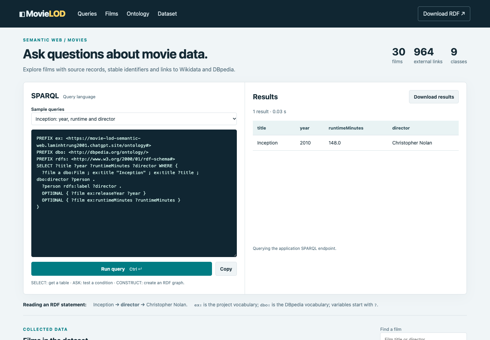

\newpage

## 0. Cách dùng tài liệu này

**Mục tiêu:** chuẩn bị một máy làm việc, tái tạo bài MovieLOD từ mã nguồn trong repo, kiểm tra 5 yêu cầu, chạy demo, công bố dữ liệu và tạo bộ nộp cuối cùng. Tài liệu ghi cả thao tác trên giao diện và lệnh terminal. Đây là hướng dẫn thực hành bổ sung cho [hướng dẫn ngắn A–Z](Huong_dan_A_Z.pdf).

Các lệnh chính dùng **macOS** theo môi trường của bài. Thu thập, chuyển đổi, server và kiểm tra cũng chạy được trên Linux khi cài đủ thư viện. Phần tạo video tự động dùng giọng `Linh` và lệnh `say` của macOS. Các file PDF, slide và video mẫu đã nằm trong repo.

**Cách thực hiện:** làm theo thứ tự các mục 1–13. Chạy từng khối lệnh, đợi lệnh hoàn tất, rồi đối chiếu phần “Kết quả cần thấy”. Nếu lỗi, đọc mục 15 trước khi tiếp tục. Lệnh không có ký hiệu `$` ở đầu; có thể sao chép từ bản Markdown để giữ đúng xuống dòng.

**Quy ước terminal:** Terminal A dùng để chạy server và giữ cửa sổ đó mở. Terminal B dùng để gọi endpoint, chạy kiểm tra và tạo tài liệu. Cả hai đều đứng trong thư mục `movie_lod_complete`. Phần lớn lệnh dùng `.venv/bin/python`, nên không cần kích hoạt môi trường bằng `source`.

**Bản hiện tại:** 15 lớp, trong đó `dbo:Film`, `dbo:Person`, `dbo:Country` được tái sử dụng trực tiếp; các kiểm tra dữ liệu cơ bản dùng Python. Với nguồn mẫu đã lưu: 30 phim, 805 người, 936 credit, 964 liên kết ngoài, 12.089 triple dữ liệu và 291 triple lược đồ. Các số này là mốc đối chiếu của bản mẫu; dữ liệu tải mới có thể thay đổi.

**Trạng thái xuất bản ghi nhận trong repo:** Ngày 07/10/2026, bản giao diện/truy vấn tiếng Anh đã được triển khai công khai; `publication.json` ghi nhận triển khai thành công. Khi tái tạo hoặc sửa dữ liệu, thực hiện mục 11–12 để xác nhận bản mới đã đồng bộ. Tài liệu hướng dẫn thao tác; việc đọc tài liệu không tự thực hiện triển khai.

| Chặng | Thao tác chính | Sản phẩm cần có |
|:--|:--|:--|
| 1–2 | Chuẩn bị môi trường, chọn dữ liệu | `.venv/`, dependencies, `config.json` |
| 3–6 | Thiết kế, thu thập, tạo RDF, xem ontology | Nguồn gốc, OWL, Turtle, JSON-LD |
| 7–9 | Kiểm tra, truy vấn và chụp minh chứng | Test pass, kết quả SPARQL, ảnh |
| 10 | Tạo sản phẩm trình bày | Báo cáo, slide, video, hướng dẫn |
| 11–12 | Xuất bản và xác nhận truy cập | Dữ liệu public khớp repo |
| 13–14 | Đóng gói và chuẩn bị bảo vệ | ZIP và một lượt demo hoàn chỉnh |

## 1. Chuẩn bị thư mục và môi trường

### 1.1. Mở đúng thư mục dự án

1. Giải nén bộ mã vào một thư mục làm việc. Giữ cùng cấu trúc `src/`, `data/`, `ontology/`, `queries/`, `web/`, `docs/` và `evidence/`.
2. Mở Finder, tìm thư mục `movie_lod_complete`.
3. Mở Terminal. Gõ `cd `, có một dấu cách sau `cd`, kéo thư mục từ Finder vào cửa sổ Terminal rồi nhấn Enter.
4. Kiểm tra vị trí hiện tại:

```bash
pwd
ls
```

**Kết quả cần thấy:** đường dẫn kết thúc bằng `movie_lod_complete`; có `README.md`, `requirements.txt`, `config.json` và các thư mục trên. Mọi lệnh còn lại mặc định chạy từ vị trí này.

### 1.2. Kiểm tra hoặc cài Python

```bash
python3 --version
```

Môi trường đã kiểm tra của repo dùng Python 3.9. Trên máy mới, có thể chọn Python 3.12 cho bộ thư viện đã ghim phiên bản. Nếu cần cài trên macOS, mở [Homebrew](https://brew.sh), làm theo hướng dẫn cài đặt chính thức, mở lại Terminal rồi chạy:

```bash
brew install python@3.12
python3.12 --version
```

Tên lệnh của bản này là `python3.12`. [Nguồn cài đặt Python 3.12](https://formulae.brew.sh/formula/python@3.12).

### 1.3. Tạo môi trường riêng và cài thư viện

Nếu dùng Python đã có:

```bash
python3 -m venv .venv
```

Nếu vừa cài Python 3.12, dùng lệnh sau **thay cho** lệnh tạo môi trường trên:

```bash
python3.12 -m venv .venv
```

Sau đó chạy:

```bash
.venv/bin/python -m pip install -r requirements.txt
.venv/bin/python -m pip check
```

**Kết quả cần thấy:** cài đặt hoàn tất; `pip check` báo `No broken requirements found`. Những thư viện chính gồm RDFLib, Flask, requests, owlrl và pytest; các thư viện còn lại phục vụ tài liệu, hình ảnh và slide.

Nếu `.venv` đã đi kèm một bản sao từ máy khác và không chạy được, đổi tên thư mục đó thành `.venv_backup`, tạo lại `.venv` bằng Python trên máy đang sử dụng rồi cài lại dependencies.

### 1.4. Chuẩn bị trình soạn thảo và Protégé

1. Dùng trình soạn thảo mã để mở cả thư mục dự án. Khi sửa JSON hoặc Python, giữ dạng văn bản thuần và mã hóa UTF-8.
2. Cài Protégé Desktop từ [trang chính thức](https://protege.stanford.edu). Chọn bản cho hệ điều hành đang dùng và làm theo [hướng dẫn cài đặt](https://protegeproject.github.io/protege/installation/).
3. Mở được Protégé là đủ cho bước này; thao tác xem mô hình và cá thể được trình bày ở mục 6.

**Hoàn tất mục 1 khi:** Python chạy được, dependencies cài thành công và bạn đã mở đúng thư mục mã.

## 2. Chốt phạm vi bài và cấu hình đầu vào

### 2.1. Xác định các câu hỏi ứng dụng phải trả lời

Viết ra các câu hỏi sau để đối chiếu mô hình và dữ liệu:

1. Bộ dữ liệu có những phim nào, phát hành năm nào, dài bao lâu?
2. Ai là đạo diễn của Inception?
3. Những phim nào trong mẫu do Christopher Nolan đạo diễn?
4. Một người tham gia một phim với vai trò nào?
5. Thông tin phim lấy từ nguồn nào và nối đến định danh ngoài nào?

Giữ phạm vi này cho lượt thực hành đầu tiên. Các trường ngân sách, giải thưởng hoặc streaming cần dữ liệu và mô hình bổ sung nếu muốn mở rộng sau đó.

### 2.2. Mở `config.json`

Đối chiếu ba nội dung:

| Trường | Thao tác | Ý nghĩa |
|:--|:--|:--|
| `base_url` | Giữ URL Site hiện có cho bài này | Gốc IRI của thực thể và ontology |
| `data_license` | Đối chiếu với `LICENSE-DATA.txt` | Giấy phép được ghi vào RDF |
| `seed_titles` | Xem danh sách 30 tiêu đề | Đầu vào cho thu thập phim |

Tiêu đề là tên trang Wikipedia tiếng Anh chính xác, ví dụ `Inception`, `Interstellar (film)`, `Dunkirk (2017 film)`. Phần trong ngoặc giúp phân biệt những trang cùng tên.

Kiểm tra JSON hợp lệ:

```bash
.venv/bin/python -m json.tool config.json
```

**Kết quả cần thấy:** JSON được in ra, không có lỗi cú pháp. Dấu phẩy sai hoặc dấu ngoặc thiếu phải được sửa trước khi chạy thu thập.

### 2.3. Quy tắc khi cần đổi tên miền

Khi đã có một URL xuất bản mới thật sự, đồng bộ namespace bằng lệnh dưới đây; thay URL ví dụ bằng URL của bạn:

```bash
.venv/bin/python src/rebase.py https://ten-mien-moi.example
```

Sau đó phải chạy lại build, validate, chuẩn bị Web và tạo lại tài liệu. `rebase.py` nhận một gốc HTTP(S) không có phần đường dẫn. Nó đồng bộ cấu hình, truy vấn và giao diện; thao tác tạo lại sản phẩm nằm ở các mục sau.

Nếu giữ Site MovieLOD hiện tại, tiếp tục với `base_url` đang có. Khi đổi danh sách phim, cần điều chỉnh các test kiểm tra số lượng cố định và nội dung mẫu trong mã tạo slide/video.

## 3. Thiết kế ontology trước khi sinh dữ liệu — YC1

### 3.1. Chọn các lớp

Mở `src/build.py`, tìm hàm `schema()`. Đối chiếu mô hình sau:

| Lớp | Cách dùng | Ví dụ trong bài |
|:--|:--|:--|
| `dbo:Film` | Dùng trực tiếp lớp DBpedia | Inception |
| `dbo:Person` | Dùng trực tiếp lớp DBpedia | Christopher Nolan |
| `dbo:Country` | Dùng trực tiếp lớp DBpedia | Một quốc gia sản xuất |
| `ex:Genre` | Lớp thuộc namespace của bài | Thể loại phim |
| `ex:Language` | Lớp thuộc namespace của bài | Ngôn ngữ gốc |
| `ex:Credit` | Một bản ghi đóng góp | Nolan làm đạo diễn trong Inception |
| `ex:ContributionRole` | Loại vai trò đóng góp | Đạo diễn, diễn viên, biên kịch |
| `ex:SourceSnapshot` | Bản ghi về phản hồi nguồn | URL, ngày lấy, SHA-256 |
| `ex:Dataset` | Mô tả bộ dữ liệu | Giấy phép, nguồn, URL tải RDF |
| `ex:Director`; `ex:Actor`; `ex:Screenwriter` | Person giao với điều kiện đã tham gia một Film | Suy ra vai trò từ quan hệ ngược |
| `ex:FilmContributor` | Hợp của ba lớp vai trò người | Người có ít nhất một vai trò |
| `ex:DirectorWriter` | Giao của Director và Screenwriter | Nolan; hai vai trò có thể ở hai phim khác nhau |
| `ex:CreditedFilm` | Film giao với điều kiện có ít nhất một Credit | Inception |

`dbo:` là `http://dbpedia.org/ontology/`; `ex:` là namespace ontology của bài. Trong `schema()`, ba lớp tái sử dụng nằm trong biến `reused`. Chúng được dùng trực tiếp trong schema và `rdf:type` của dữ liệu.

Đối chiếu định nghĩa gốc: [DBpedia Film](https://dbpedia.org/ontology/Film), [Person](https://dbpedia.org/ontology/Person), [Country](https://dbpedia.org/ontology/Country).

### 3.2. Đối chiếu quan hệ giữa các thực thể

Tìm biến `obj` và phần khai báo các quan hệ DBpedia trong `schema()`:

| Quan hệ | Chủ thể → đối tượng | Câu đọc dễ hiểu |
|:--|:--|:--|
| `dbo:director` | Film → Person | Phim có đạo diễn là người này |
| `dbo:starring` | Film → Person | Người này diễn xuất trong phim |
| `dbo:writer` | Film → Person | Người này viết kịch bản |
| `ex:hasCredit` | Film → Credit | Phim có bản ghi đóng góp |
| `ex:inFilm` | Credit → Film | Đóng góp thuộc phim nào |
| `ex:participant` | Credit → Person | Ai thực hiện đóng góp |
| `ex:role` | Credit → ContributionRole | Người đó làm vai trò gì |
| `ex:hasGenre` | Film → Genre | Phim có thể loại nào |
| `ex:country` | Film → Country | Quốc gia sản xuất |
| `ex:language` | Film → Language | Ngôn ngữ gốc |
| `ex:sourceSnapshot` | Thực thể → SourceSnapshot | Thông tin gắn với bản ghi nguồn |

### 3.3. Đối chiếu thuộc tính giá trị

| Thuộc tính | Kiểu giá trị | Ví dụ |
|:--|:--|:--|
| `ex:title` | `xsd:string` | Inception |
| `ex:releaseYear` | `xsd:integer` | 2010 |
| `ex:runtimeMinutes` | `xsd:decimal` | 148.0 |
| `ex:sourceUrl` | `xsd:anyURI` | URL API nguồn |
| `ex:retrievedAt` | `xsd:dateTime` | Thời điểm lấy phản hồi |
| `ex:sha256` | `xsd:string` | Mã băm 64 ký tự |

### 3.4. Kiểm tra quy tắc OWL đã định nghĩa

Trong `schema()`, tìm `qualifiedCardinality`, `allValuesFrom`, `inverseOf` và `AllDisjointClasses`. Cần thấy:

1. Một credit nối đúng 1 phim, 1 người và 1 vai trò.
2. Vai trò sử dụng ba cá thể `DirectorRole`, `ActorRole`, `WriterRole`.
3. `dbo:director` ngược với `ex:directed`; tương tự có quan hệ ngược cho diễn xuất và biên kịch.
4. Chín lớp nền rời nhau qua AllDisjointClasses và 36 cặp disjointWith; các lớp vai trò người có thể chồng lấp.
5. Sáu defined class dùng equivalentClass, intersectionOf, unionOf, someValuesFrom. Chạy `.venv/bin/python src/reason.py`; xem `evidence/ontology_reasoning.json` và [mô tả ontology](Mo_ta_ontology.md).

**Thao tác nếu sửa mô hình:** sửa hàm `schema()` trong `src/build.py`, đồng bộ phần sinh thực thể trong `build()`, các câu truy vấn và kiểm tra có liên quan; sau đó tạo lại sản phẩm. Các file OWL và Turtle là đầu ra do script sinh. Nếu sửa thử trong Protégé, lưu một bản riêng để so sánh, rồi đưa thay đổi cần giữ vào mã nguồn.

**Hoàn tất mục 3 khi:** giải thích được vai trò của 15 lớp và đường đi “phim → credit → người + vai trò + nguồn”. Các file ontology sẽ được tạo cùng bước chuyển đổi ở mục 5.

## 4. Thu thập dữ liệu thật và giữ nguồn — YC2

### 4.1. Chạy từ nguồn mẫu đã lưu

```bash
.venv/bin/python src/collect.py
```

Script kiểm tra hash của cache trước khi dùng. Những URL chưa có cache hợp lệ sẽ được tải qua Internet.

**Kết quả cần thấy:** thông báo các batch Wikidata và từng phim DBpedia; có `data/raw/snapshots.json`, phản hồi nguồn và `data/processed/collected.json`.

### 4.2. Tải mới nếu cần cập nhật nguồn

Khi muốn lấy phản hồi mới từ API thay cho cache, chạy:

```bash
.venv/bin/python src/collect.py --refresh
```

Đợi tải xong; không đóng terminal giữa chừng. Chạy mới có thể làm thay đổi số người, thời lượng, liên kết hoặc số triple. Sau lần này phải chạy lại các bước chuyển đổi, kiểm tra và tài liệu.

### 4.3. Đọc kết quả thu thập

```bash
.venv/bin/python -m json.tool evidence/collection.json
```

Với bản mẫu, các trường chính là `requested_films = 30`, `resolved_films = 30`, `snapshots = 56`, `dbpedia_links = 28`. Hai phim Tenet và The Prestige không được nối DBpedia vì phản hồi không khai báo rõ chủ thể `dbo:Film`; chúng vẫn có dữ liệu Wikidata.

Nếu có `missing_titles`, kiểm tra tên trong `seed_titles` có đúng trang Wikipedia hay không. Các lỗi DBpedia riêng lẻ cần được đọc và ghi nhận; điều kiện hoàn tất bước này là các phim chọn đã được giải quyết danh tính và có nguồn sử dụng được.

### 4.4. Kiểm tra một phản hồi nguồn bằng tay

1. Mở `data/raw/snapshots.json` bằng trình soạn thảo.
2. Chọn một bản ghi, tìm `path`, `url`, `retrieved_at`, `http_status`, `sha256`.
3. Mở file ở `path` để xem phản hồi API gốc.
4. Trong terminal, dùng `shasum -a 256` với đường dẫn file vừa chọn. Thay phần ví dụ bằng `path` thật:

```bash
shasum -a 256 data/raw/TEN_FILE_NGUON.json
```

5. So sánh mã băm in ra với `sha256` trong metadata. Kiểm tra tự động toàn bộ hash nằm ở mục 7.

**Hoàn tất mục 4 khi:** có đủ phim đã chọn, dữ liệu staging và phản hồi gốc truy lại được bằng URL, thời điểm và mã băm.

## 5. Sinh ontology, chuyển đổi RDF và chuẩn bị Web — YC1, YC3, YC4

### 5.1. Chạy build

```bash
.venv/bin/python src/build.py
.venv/bin/python src/prepare_web.py
```

Lệnh đầu đọc dữ liệu thu thập, tạo ontology, RDF và các trang thực thể. Lệnh sau đồng bộ câu truy vấn mẫu, giấy phép và PDF vào thư mục Web.

**Kết quả cần thấy:** số liệu được in ra; với nguồn mẫu có 30 phim, 15 lớp, 12.089 triple dữ liệu, 291 triple lược đồ và 964 liên kết ngoài.

### 5.2. Kiểm tra những file được tạo

| Đầu ra | Thao tác kiểm tra |
|:--|:--|
| `ontology/Movie_Ontology.owl` | Mở bằng Protégé để xem mô hình |
| `ontology/movie.ttl` | Đọc khai báo lớp, quan hệ và ràng buộc |
| `ontology/Movie_Knowledge_Graph.owl` | Mở để xem mô hình cùng cá thể |
| `data/processed/movies.ttl` | Đọc triple của dữ liệu |
| `data/processed/movies.jsonld` | Xem bản xuất JSON-LD |
| `data/processed/films.csv` | Xem bảng tóm tắt bằng phần mềm bảng tính |
| `evidence/statistics.json` | Đối chiếu số lượng thực tế |
| `evidence/link_audit.json` | Đối chiếu cặp IRI và phương pháp nối |
| `web/dist/` | Đầu ra Web tĩnh để phục vụ và xuất bản |

### 5.3. Theo dõi cách chuẩn hóa một phim

Trong `build()`, tìm các phần đọc `P577` và `P2047`:

1. Ngày phát hành được chọn theo các phát biểu hợp lệ, giữ năm sớm nhất của các giá trị được xét.
2. Thời lượng phút, giây hoặc giờ được chuyển về phút.
3. Nếu có nhiều thời lượng, script giữ giá trị theo chính sách chọn phát biểu và ghi vấn đề vào `quality_issues.json`.
4. Người hoặc thuật ngữ thiếu dữ liệu cần dùng có thể bị bỏ qua và được ghi nhận.

Mở `evidence/quality_issues.json`, đọc lý do các trường hợp bị bỏ hoặc có nhiều giá trị. Khi báo cáo, nói rõ chính sách này thay vì coi mọi giá trị tóm tắt là duy nhất ngoài đời.

### 5.4. Kiểm tra tái sử dụng lớp và liên kết cá thể

Trong Turtle, tìm Inception bằng `film-Q25188`. Cần thấy kiểu `dbo:Film` và quan hệ `dbo:director`. Tìm `person-Q25191` để thấy kiểu `dbo:Person`.

Trong `link_audit.json`, tìm `film-Q25188`. Cần thấy liên kết tới Wikidata Q25188 và DBpedia Inception, cùng phương pháp nối. Số liên kết của bản mẫu: 936 Wikidata, 28 DBpedia. Tái sử dụng lớp là việc dùng từ vựng ontology; `owl:sameAs` là việc nối các cá thể cùng danh tính.

**Hoàn tất mục 5 khi:** các bản OWL/RDF đã được sinh, giấy phép có trong dữ liệu và thư mục Web sẵn sàng để chạy.

## 6. Thao tác xem ontology và cá thể trong Protégé

### 6.1. Xem mô hình

Mở Protégé, chọn **File → Open**, mở `ontology/Movie_Ontology.owl`. Trong **Entities**, chọn phần **Classes**, mở các lớp dưới `owl:Thing`. Chọn từng lớp để xem mô tả và IRI. Có thể dùng **Search** hoặc Cmd+F để tìm lớp. [Hướng dẫn giao diện Protégé](https://protegeproject.github.io/protege/getting-started/).

**Đối chiếu mô hình của bài:** tổng có 15 lớp được khai báo. `Film`, `Person`, `Country` dùng IRI bắt đầu bằng `http://dbpedia.org/ontology/`; các lớp khác dùng namespace của bài. Bản hiện tại dùng nhãn tiếng Anh “Film”, “Person”, “Country”; đọc IRI của lớp đang chọn để xác định chính xác.

Protégé có thể hiển thị thêm các lớp ngoài được tham chiếu trong `equivalentClass` hoặc dữ liệu, như lớp căn chỉnh của Genre, Language và Dataset. Khi đối chiếu mốc 15 lớp, dùng danh sách mô hình ở mục 3 và trường `classes` trong `statistics.json`; đây là số lớp có tên được khai báo trực tiếp bằng `owl:Class` trong lược đồ, không tính biểu thức lớp vô danh, không phải tổng mọi tên lớp mà trình soạn thảo nhận diện.

### 6.2. Xem quan hệ và ràng buộc

Trong **Entities**, chuyển sang **Object properties**, chọn `director`, `participant`, `inFilm`, `role`; xem domain, range và đặc tính. Chọn lớp `Credit` để xem mô tả superclass. Các view mô tả lớp và thuộc tính được giải thích trong [tài liệu Views của Protégé](https://protegeproject.github.io/protege/views/).

**Đối chiếu riêng cho bài:** `participant` có range `dbo:Person`; `inFilm` có range `dbo:Film`; `Credit` có các ràng buộc đúng một người, một phim, một vai trò. `director` có inverse `directed`.

### 6.3. Xem dữ liệu của Inception

1. Mở thêm `ontology/Movie_Knowledge_Graph.owl`.
2. Trong phần cá thể của **Entities**, tìm `film-Q25188`.
3. Đọc kiểu của phim, tên, năm, thời lượng và các quan hệ.
4. Theo `director` đến `person-Q25191`.
5. Theo một `hasCredit` để xem phim, người, vai trò và nguồn được ghi riêng.

Nếu chưa thấy cá thể, kiểm tra đang mở file knowledge graph. File `Movie_Ontology.owl` chứa lược đồ và ba cá thể vai trò; không chứa danh sách 30 phim.

**Minh chứng nên chụp:** lớp tái sử dụng với IRI, ràng buộc của `Credit`, cá thể Inception và một credit của Nolan. Các thao tác xem này giúp giải thích YC1; kiểm tra suy luận tự động của bài nằm trong test ở mục 7.

## 7. Kiểm tra dữ liệu, hash, truy vấn và test

### 7.1. Chạy kiểm tra bằng Python

```bash
.venv/bin/python src/validate.py
```

**Kết quả cần thấy với bản mẫu:**

```json
{
  "data_checks_passed": true,
  "data_errors": [],
  "source_hashes_match": true,
  "snapshots_checked": 56,
  "query_files_executed": 8,
  "films_have_sources": true,
  "films_have_external_links": true
}
```

`check_data()` kiểm tra tên/nguồn/liên kết của phim, các thành phần của credit và metadata nguồn. Sau đó script kiểm tra hash phản hồi gốc và chạy 8 file truy vấn. Kết quả được lưu vào `evidence/validation.json` và `evidence/query_results.json`.

Nếu `data_checks_passed` là `false`, đọc `data_errors`, sửa đầu vào hoặc phần chuyển đổi có liên quan rồi build và validate lại. Nếu hash sai, kiểm tra phản hồi gốc có bị thay đổi; dùng thu thập lại để lấy phản hồi và metadata hợp lệ.

### 7.2. Chạy test ứng dụng

```bash
.venv/bin/python -m pytest -q
```

**Kết quả cần thấy:** `8 passed`; thời gian chạy tùy máy. Test kiểm tra Inception, vai trò của Nolan, giao thức endpoint, ASK/CONSTRUCT, truy vấn sai, tra cứu RDF, truy vấn lớp DBpedia và suy luận OWL RL. Có test cố ý làm thiếu người trong credit để xác nhận kiểm tra Python phát hiện lỗi.

Muốn lưu một biên bản test mới:

```bash
.venv/bin/python -m pytest -q > evidence/tests.txt
cat evidence/tests.txt
```

Đọc kết quả trong file để xác nhận pass. Kiểm tra cơ bản bằng Python và suy luận OWL RL có phạm vi riêng; chúng không chứng minh mọi dữ kiện đúng ngoài đời hoặc mọi ràng buộc OWL đều đã được kiểm tra.

**Hoàn tất mục 7 khi:** dữ liệu hợp lệ trong phạm vi kiểm tra, hash khớp, 8 truy vấn chạy được và toàn bộ test pass.

## 8. Chạy ứng dụng và truy vấn theo ba cách — YC5

### 8.1. Khởi động server trong Terminal A

```bash
.venv/bin/python src/server.py
```

Đợi dòng `Running on http://127.0.0.1:8000`. Giữ terminal này mở. Sau mỗi lần build lại dữ liệu, dừng server bằng Ctrl+C rồi chạy lại để nạp graph mới.

Nếu cổng đã được sử dụng, có thể chọn cổng khác:

```bash
.venv/bin/python src/server.py --port 8001
```

Khi chọn 8001, dùng 8001 trong mọi URL cục bộ. Script chụp minh chứng ở mục 9 hiện dùng cổng 8000; chuẩn bị server ở cổng đó khi chạy script.

### 8.2. Kiểm tra qua giao diện Web

1. Mở trình duyệt, nhập `http://127.0.0.1:8000`.
2. Trong ô câu hỏi mẫu, chọn **Inception: year, runtime and director**.
3. Bấm **Run query** nếu chưa có kết quả.
4. Đọc bảng: Inception, năm 2010, 148 phút, Christopher Nolan trong nguồn mẫu.
5. Chọn **Films directed by Christopher Nolan**; mẫu hiện có 8 phim.
6. Chọn câu hỏi về vai trò; cần thấy Nolan làm đạo diễn và biên kịch.
7. Chọn câu ASK; cần thấy `True`.
8. Bấm **Download results** để lưu kết quả truy vấn.
9. Tìm Inception trong danh sách phim, mở trang thực thể và bấm tải RDF.

{width=95%}

### 8.3. Kiểm tra bằng terminal

Trong Terminal B, chuyển đến thư mục repo rồi chạy:

```bash
.venv/bin/python src/query.py queries/02_inception.rq
.venv/bin/python src/query.py queries/08_ask.rq
```

**Kết quả cần thấy:** lệnh đầu trả JSON chứa các biến `title`, `year`, `runtimeMinutes`, `director`; lệnh thứ hai trả boolean `true`. Lệnh terminal đọc graph trực tiếp từ file, nên có thể dùng ngay cả khi server chưa chạy.

### 8.4. Kiểm tra endpoint

Khi Terminal A đang chạy server, trong Terminal B gọi:

```bash
curl -X POST http://127.0.0.1:8000/sparql \
  -H 'Content-Type: application/sparql-query' \
  --data-binary @queries/02_inception.rq
```

**Kết quả cần thấy:** SPARQL Results JSON của Inception. GET và POST đều được hỗ trợ; SELECT/ASK trả JSON, CONSTRUCT trả Turtle.

### 8.5. Kiểm tra tra cứu RDF cục bộ

```bash
curl -i -H 'Accept: text/turtle' \
  http://127.0.0.1:8000/resource/film-Q25188
```

Cần thấy HTTP 303 và đường dẫn `Location` tới mô tả `.ttl`. Theo chuyển hướng để lấy RDF:

```bash
curl -L -H 'Accept: text/turtle' \
  http://127.0.0.1:8000/resource/film-Q25188
```

Cần thấy các triple của Inception, gồm kiểu `dbo:Film`. Máy chủ cục bộ và bản hosted tĩnh có cách phục vụ khác nhau; tra cứu hosted được kiểm tra riêng ở mục 12.

### 8.6. Theo dõi 8 câu hỏi mẫu

| File | Nội dung | Kết quả của nguồn mẫu |
|:--|:--|:--|
| `01_films.rq` | Danh sách phim | 30 dòng |
| `02_inception.rq` | Năm, thời lượng, đạo diễn | 1 dòng |
| `03_nolan.rq` | Phim của Nolan | 8 dòng |
| `04_credits.rq` | Người và vai trò trong Inception | 23 dòng |
| `05_external_links.rq` | Liên kết ngoài của phim | 58 dòng |
| `06_genres.rq` | Thống kê theo thể loại | 75 dòng |
| `07_source.rq` | Nguồn của Inception | 2 dòng |
| `08_ask.rq` | Liên kết Inception–Wikidata | `true` |

Muốn sửa truy vấn, mở file `.rq`, giữ các prefix và mẫu quan hệ phù hợp. Sau khi sửa, chạy terminal để kiểm tra rồi chạy `src/prepare_web.py` để đồng bộ câu hỏi vào giao diện; tải lại trang Web.

**Hoàn tất mục 8 khi:** cùng một câu hỏi chạy được qua giao diện, terminal và endpoint; có thể giải thích kết quả theo các quan hệ trong graph.

## 9. Chụp minh chứng và kiểm tra trình duyệt

### 9.1. Cài phần kiểm tra bổ sung

Giữ server mới chạy ở cổng 8000. Cài Playwright vào đúng môi trường đang dùng:

```bash
.venv/bin/python -m pip install playwright
```

Script dùng Google Chrome đã cài trên macOS nếu tìm thấy. Nếu không có Chrome, cài Chromium cho Playwright:

```bash
.venv/bin/python -m playwright install chromium
```

Các lệnh cài thư viện và trình duyệt được đối chiếu với [hướng dẫn Playwright Python](https://playwright.dev/python/docs/intro).

### 9.2. Chạy script

```bash
.venv/bin/python src/browser_check.py
```

**Kết quả cần thấy:** 9 kiểm tra đều có `passed = true`; có bốn ảnh mới:

| File | Nội dung cần thấy |
|:--|:--|
| `evidence/screenshots/01_app.png` | Truy vấn Inception và bảng kết quả |
| `evidence/screenshots/02_nolan.png` | Danh sách phim của Nolan |
| `evidence/screenshots/03_resource.png` | Trang IRI Inception, liên kết và nguồn |
| `evidence/screenshots/04_mobile.png` | Giao diện màn hình điện thoại |

Mở từng ảnh và xác nhận ảnh thuộc dữ liệu/truy vấn hiện tại. Báo cáo và video sử dụng các ảnh này, nên thực hiện bước này trước khi tạo lại sản phẩm trình bày.

Nếu thực hiện chụp thủ công, mở các màn hình tương ứng, lưu đúng tên ảnh và ghi rõ những kiểm tra nào đã làm thật. `package.py` hiện đọc biên bản trình duyệt, vì vậy biên bản phải phù hợp với cách kiểm tra và dữ liệu đã thực hiện.

**Hoàn tất mục 9 khi:** có ảnh đọc được và biên bản kiểm tra trình duyệt phản ánh đúng bản đang dùng.

## 10. Tạo báo cáo, hướng dẫn, slide và video

### 10.1. Cài công cụ tạo tài liệu trên macOS

```bash
brew install pandoc tectonic ffmpeg
brew install --cask font-be-vietnam-pro
```

Đối chiếu các hướng dẫn chính thức: [Pandoc](https://pandoc.org/installing.html), [Tectonic](https://tectonic-typesetting.github.io/book/latest/getting-started/install.html), [font Be Vietnam Pro](https://formulae.brew.sh/cask/font-be-vietnam-pro).

Kiểm tra lệnh đã tìm thấy:

```bash
pandoc --version
tectonic --version
ffmpeg -version
```

Mã tạo PDF dùng Be Vietnam Pro và Menlo. Mã tạo slide/video đọc font Be Vietnam Pro trong thư mục Fonts của người dùng; cài font bằng lệnh trên đáp ứng vị trí này trên macOS.

### 10.2. Tạo lại báo cáo và hướng dẫn ngắn

```bash
.venv/bin/python src/make_docs.py
```

**Kết quả cần thấy:** `Reports created`; các file `docs/Bao_cao.pdf` và `docs/Huong_dan_A_Z.pdf` được cập nhật. Với nội dung hiện tại, báo cáo có 5 trang, hướng dẫn ngắn có 4 trang. Báo cáo nộp phải không quá 15 trang.

Nếu muốn thay đổi nội dung mà script sinh, chỉnh template trong `src/make_docs.py` rồi tạo lại. Script sẽ ghi lại các file Markdown báo cáo/hướng dẫn ngắn; đây là nơi cần giữ thay đổi lâu dài.

### 10.3. Tạo lại tài liệu thao tác này

```bash
.venv/bin/python src/make_manual.py
```

**Kết quả cần thấy:** `docs/Huong_dan_thao_tac_chi_tiet.pdf`. Có thể sửa trực tiếp `docs/Huong_dan_thao_tac_chi_tiet.md` rồi chạy lệnh trên. File này là tài liệu bổ sung, tách khỏi báo cáo học phần.

### 10.4. Tạo slide

Mở `src/make_slides_video.py`, xem hàm `slides_spec()`; nếu chỉnh nội dung, giữ phần mô hình, số liệu và ảnh đúng bản hiện tại. Tạo slide mà chưa tạo video:

```bash
.venv/bin/python src/make_slides_video.py --slides-only
```

Mở `docs/Slide.pptx`, lần lượt kiểm tra 8 slide. Mở `docs/Slide.pdf` để kiểm tra bản đọc. Kịch bản nằm ở `docs/Kich_ban_video.md`; lời thuyết trình cũng có trong notes của slide.

### 10.5. Tạo video tự động

Trên macOS, kiểm tra giọng `Linh` bằng lệnh sau; cuộn danh sách giọng để tìm tên đó:

```bash
say -v '?'
```

Nếu cần tải giọng: mở **System Settings → Accessibility → Read & Speak**, mở **System voice** và phần quản lý/thông tin giọng. Chọn tiếng Việt, tải giọng phù hợp, đợi hoàn tất rồi kiểm tra lại bằng `say -v '?'`. Tên mục có thể là Spoken Content trên các bản macOS trước. [Hướng dẫn giọng đọc của Apple](https://support.apple.com/en-kw/guide/mac-help/mchlp2290/mac). Script hiện gọi giọng `Linh`; nếu chọn giọng Việt khác, sửa tên giọng trong `create_video()` trước khi tạo.

Sau đó:

```bash
.venv/bin/python src/make_slides_video.py
```

**Kết quả cần thấy:** tạo đủ 8 đoạn, có `docs/Video_demo.mp4`, thời lượng khoảng 256 giây (4 phút 16 giây). Mở video và nghe thử đầu, giữa, cuối; đối chiếu slide và ảnh, âm lượng, lời đọc.

### 10.6. Tự quay một lượt thao tác thay cho video tổng hợp

1. Chuẩn bị màn hình và kịch bản theo mục 14.
2. Nhấn **Shift+Command+5**, chọn ghi màn hình hoặc một vùng màn hình.
3. Mở **Options**, chọn microphone để thu lời nói và vị trí lưu.
4. Bấm **Record**, thực hiện demo 3–5 phút, rồi bấm nút dừng trên thanh menu.
5. Mở video nghe thử; đổi tên và đặt file nguồn thành `docs/Video_tu_quay.mov`.

[Thao tác ghi màn hình của Apple](https://support.apple.com/en-gb/102618).

Chuyển file nguồn sang MP4 bằng FFmpeg. Lệnh sau tạo lại file video nộp; chỉ chạy khi đã chọn dùng bản tự quay:

```bash
ffmpeg -y -i docs/Video_tu_quay.mov \
  -c:v libx264 -pix_fmt yuv420p -c:a aac \
  -movflags +faststart docs/Video_demo.mp4
```

Cấu trúc lệnh đọc file đầu vào, chọn codec và ghi file đầu ra theo [tài liệu FFmpeg](https://ffmpeg.org/ffmpeg.html). Cập nhật metadata từ file MP4 thật bằng khối lệnh sau:

```bash
.venv/bin/python - <<'PY'
import json
import subprocess
from pathlib import Path

info = json.loads(subprocess.check_output([
    'ffprobe', '-v', 'error', '-show_format', '-show_streams',
    '-of', 'json', 'docs/Video_demo.mp4',
]))
video = next(s for s in info['streams'] if s['codec_type'] == 'video')
seconds = float(info['format']['duration'])
assert 180 <= seconds <= 300, seconds
metadata = {
    'file': 'docs/Video_demo.mp4',
    'duration_seconds': seconds,
    'width': video['width'],
    'height': video['height'],
    'narration': 'Loi thuyet trinh tu thu trong video thao tac',
}
Path('evidence/video.json').write_text(
    json.dumps(metadata, ensure_ascii=False, indent=2) + '\n',
    encoding='utf-8',
)
print('Video duration:', seconds)
PY
```

**Kết quả cần thấy:** thời lượng nằm trong 180–300 giây và metadata phù hợp với video thật. Script đóng gói dùng trường `duration_seconds` này.

### 10.7. Đồng bộ sản phẩm vào thư mục Web

```bash
.venv/bin/python src/prepare_web.py
```

Lệnh này sao chép PDF đã tạo vào `web/dist/docs/`. Thực hiện sau khi tạo PDF để bản Web nhận tài liệu mới.

**Hoàn tất mục 10 khi:** báo cáo, hướng dẫn, slide, video đều mở được và giải thích cùng một phiên bản mô hình/dữ liệu.

## 11. Xuất bản bản mới lên Site và chọn public — YC3, YC4

### 11.1. Xác định đúng bản đưa lên Web

Đầu ra cần xuất bản là **`web/dist` hiện tại**. Cấu hình Site có sẵn ở `web/.openai/hosting.json`; giữ liên kết với Site MovieLOD đang dùng.

Trước khi xuất bản, xác nhận đã thực hiện các mục 5, 7, 9 và 10. Bản hosted của dự án này phục vụ Web tĩnh; Comunica truy vấn RDF trong trình duyệt. Endpoint Python ở mục 8 phục vụ bản cục bộ.

### 11.2. Đưa phiên bản repo hiện tại lên Site bằng Codex

1. Mở dự án này trong Codex, giữ thư mục gốc là `movie_lod_complete`.
2. Gửi yêu cầu triển khai rõ ràng, có thể dùng nội dung sau:

> Xuất bản bản MovieLOD hiện tại trong repo lên Site hiện có. Dùng cấu hình trong web/.openai/hosting.json, giữ nguyên Site và quyền public. Đồng bộ thư mục web/dist, gồm RDF, ontology, truy vấn và PDF mới. Kiểm tra trạng thái triển khai thành công, trả URL và các thông tin phiên bản để lưu minh chứng.

3. Đợi quy trình hoàn thành và đọc URL thành công do Sites trả về.
4. Ghi nhận version/deployment/source của lần này theo kết quả thật. Trạng thái đang build hoặc pending cần được theo dõi đến khi kết thúc.

Sites có bước lưu phiên bản và bước triển khai phiên bản; việc cập nhật file local chỉ chuẩn bị đầu ra cho quy trình này. [OpenAI — Sites và các phiên bản triển khai](https://learn.chatgpt.com/docs/sites#understand-projects-versions-and-deployments).

### 11.3. Chuyển quyền truy cập khi cần

1. Mở [Sites trong ChatGPT](https://chatgpt.com/sites) bằng tài khoản sở hữu Site.
2. Chọn **MovieLOD — Linked movie data**.
3. Mở **Share**.
4. Ở **Who has access**, chọn **Anyone on the internet**.
5. Hoàn tất thao tác xuất bản/lưu quyền theo giao diện đang hiển thị.

Site public có thể được truy cập ngoài workspace. [OpenAI — quyền truy cập Sites](https://learn.chatgpt.com/docs/sites#control-access-and-secrets). Với dự án này, repo đang ghi nhận public; cần kiểm tra lại quyền thực tế sau khi triển khai.

### 11.4. Giữ giấy phép và thông tin tải dữ liệu

Đảm bảo bản đưa lên Web có `LICENSE-DATA.txt`, `data/movies.ttl`, `data/movies.jsonld`, ontology và các trang thực thể. Giấy phép đang dùng trong repo là CC BY-SA 4.0, ghi công nguồn trong file giấy phép và metadata RDF.

Theo [W3C — thang Linked Open Data](https://www.w3.org/DesignIssues/LinkedData.html), các mức sao cộng dồn: dữ liệu có trên Web với giấy phép mở, biểu diễn có cấu trúc và định dạng mở, dùng RDF/định danh, rồi nối sang dữ liệu khác. Bước 12 xác nhận phần công bố và liên kết của bài đang hoạt động thực tế.

**Hoàn tất mục 11 khi:** có bản triển khai thành công của dữ liệu hiện tại và quyền truy cập phù hợp. Tiếp tục kiểm tra từ phía người dùng ở mục 12 trước khi đánh dấu hoàn tất công bố.

## 12. Kiểm tra public và xác nhận hosted khớp repo

### 12.1. Kiểm tra bằng trình duyệt ẩn danh

Mở một cửa sổ ẩn danh, không đăng nhập tài khoản chủ sở hữu. Mở lần lượt:

| Đường dẫn trên Site | Kết quả cần thấy |
|:--|:--|
| `/` | Giao diện phim và truy vấn |
| `/data/movies.ttl` | Tải hoặc xem được Turtle |
| `/data/movies.jsonld` | Tải hoặc xem được JSON-LD |
| `/resource/film-Q25188` | Trang mô tả Inception và liên kết RDF |
| `/resource/film-Q25188/index.ttl` | RDF riêng của Inception |
| `/ontology` | Trang mô tả ontology |
| `/ontology.ttl` | RDF của ontology |
| `/LICENSE-DATA.txt` | Giấy phép và ghi công |

Nếu dùng URL hiện tại, gốc Site là `https://movie-lod-semantic-web.laminhtrung2001.chatgpt.site`. Nếu đổi URL, lấy `base_url` trong `config.json` để ghép các đường dẫn trên.

Chạy lại câu hỏi Inception, Nolan và ASK trên giao diện hosted. Cần nhận được kết quả phù hợp với bản local. Mở ontology để xác nhận ba lớp DBpedia được dùng trong bản vừa xuất bản.

### 12.2. Kiểm tra HTTP và định dạng tải

Thay gốc URL dưới đây nếu bạn đã rebase dự án:

```bash
curl -I -L \
  https://movie-lod-semantic-web.laminhtrung2001.chatgpt.site/data/movies.ttl
```

Cần truy cập được dữ liệu, không gặp HTTP 401/403. Kiểm tra kiểu nội dung phục vụ: Turtle nên là `text/turtle`, JSON-LD là `application/ld+json`, OWL RDF/XML là `application/rdf+xml`.

Nếu server trả `application/octet-stream`, file có thể vẫn tải được; ghi nhận kết quả và chỉnh cấu hình phục vụ định dạng trên hosting để máy nhận diện RDF tốt hơn. `web/dist/_headers` có quy tắc dự kiến cho Turtle, nhưng cần kiểm tra phản hồi thật để biết hosting đã áp dụng hay chưa.

### 12.3. So sánh RDF hosted với file trong repo

Từ thư mục gốc, chạy nguyên khối lệnh sau. Nó đọc `base_url`, tải dữ liệu qua HTTP không có thông tin đăng nhập, so sánh graph và lưu biên bản vào `evidence/publication_comparison.json`:

```bash
.venv/bin/python - <<'PY'
import json
from datetime import datetime, timezone
from pathlib import Path
import requests
from rdflib import Graph
from rdflib.compare import isomorphic

base = json.loads(Path('config.json').read_text())['base_url']
items = [
    ('/data/movies.ttl', 'data/processed/movies.ttl', 'turtle'),
    ('/data/movies.jsonld', 'data/processed/movies.jsonld', 'json-ld'),
    ('/ontology.ttl', 'ontology/movie.ttl', 'turtle'),
    ('/resource/film-Q25188/index.ttl',
     'web/dist/resource/film-Q25188/index.ttl', 'turtle'),
]
rows = []
for remote, local, fmt in items:
    response = requests.get(base + remote, timeout=30)
    response.raise_for_status()
    hosted = Graph().parse(data=response.content, format=fmt)
    expected = Graph().parse(local, format=fmt)
    same = isomorphic(hosted, expected)
    rows.append({
        'url': base + remote,
        'http_status': response.status_code,
        'content_type': response.headers.get('Content-Type'),
        'matches_local': same,
        'triples': len(hosted),
    })
    print(remote, 'matches_local =', same)

summary = {
    'checked_at': datetime.now(timezone.utc).isoformat(),
    'checks': rows,
    'all_graphs_match': all(row['matches_local'] for row in rows),
}
Path('evidence/publication_comparison.json').write_text(
    json.dumps(summary, ensure_ascii=False, indent=2) + '\n',
    encoding='utf-8',
)
if not summary['all_graphs_match']:
    raise SystemExit('Hosted data differs from this repo. Republish it.')
PY
```

**Kết quả cần thấy:** cả bốn dòng `matches_local = True`, `all_graphs_match = true` trong biên bản. So sánh graph xử lý khác biệt cách viết RDF/blank node; nó xác nhận nội dung dữ liệu tương đương, không đòi file phải có cùng byte.

Nếu `False`, xem lại đã xuất bản đúng thư mục `web/dist` và đúng Site hay chưa. Đối chiếu phiên bản triển khai, tải lại trang và thực hiện kiểm tra sau khi bản mới thành công.

### 12.4. Cập nhật trạng thái theo minh chứng thật

Sau khi graph khớp, IRI/giấy phép mở được và giao diện hosted chạy đúng:

1. Mở `evidence/publication.json`.
2. Giữ URL và các ID phiên bản/triển khai/nguồn đúng kết quả Sites đã trả về; cập nhật nếu có lần triển khai mới.
3. Ghi audience và status thực tế. Chỉ đặt `local_changes_pending_publication = false` khi bản dữ liệu hiện tại đã được đối chiếu đạt.
4. Cập nhật ghi chú, biên bản truy cập và phần trạng thái trong README để phản ánh lần kiểm tra này.
5. Tạo lại báo cáo/hướng dẫn từ metadata mới, chạy `prepare_web.py`, rồi xuất bản bổ sung nếu cần đồng bộ PDF trên Site.

**Hoàn tất mục 12 khi:** người ngoài truy cập được, dữ liệu public khớp repo và trạng thái trong hồ sơ đúng với kết quả đã kiểm tra.

## 13. Đối chiếu 5 yêu cầu và tạo ZIP nộp bài

### 13.1. Đọc checklist trước khi đóng gói

| Yêu cầu | Thao tác xác nhận | Minh chứng để nộp |
|:--|:--|:--|
| YC1 — Ontology | Mở mô hình, giải thích lớp/quan hệ/ràng buộc | OWL, `schema()`, ảnh Protégé, test suy luận |
| YC2 — Thu thập | Đọc nguồn và kết quả, kiểm tra hash | Mã thu thập, raw, manifest nguồn |
| YC3 — Mức 4 sao | Đọc RDF, giấy phép, IRI và kiểm tra public | Turtle/JSON-LD, giấy phép, biên bản public |
| YC4 — Mức 5 sao | Chạy truy vấn liên kết, đối chiếu audit và public | `sameAs`, `link_audit.json`, truy vấn 05/08 |
| YC5 — Truy vấn | Chạy Web, terminal và endpoint | Mã, `.rq`, kết quả, ảnh, video |

Thang chấm trong [CHAM_DIEM.md](../CHAM_DIEM.md) là đề xuất; file có phần ghi nhận những lần thay đổi trước. Đánh giá lần nộp cuối phải dựa vào các minh chứng mới nhất. Việc tái sử dụng lớp đã được triển khai ở YC1; điều kiện công bố 4–5 sao cần hoàn tất ở mục 11–12.

### 13.2. Kiểm tra sản phẩm nộp

1. Mở báo cáo PDF, xác nhận không quá 15 trang và số liệu đúng.
2. Mở PPTX/PDF slide, xác nhận nội dung đọc được và cùng namespace hiện tại.
3. Mở video, xác nhận dài 3–5 phút, hình và lời đọc phù hợp.
4. Có mã, dữ liệu gốc, ontology, dữ liệu RDF, truy vấn, giấy phép và hướng dẫn chạy.
5. Kiểm tra biên bản test/public thuộc bản đang nộp.

### 13.3. Đóng gói

```bash
.venv/bin/python src/package.py
```

**Kết quả cần thấy:** script kiểm tra các bản graph, số trang, slide, thời lượng video và biên bản trình duyệt; in đường dẫn ZIP. File nằm **bên cạnh** thư mục dự án, tên `movie_lod_complete.zip`.

Script cập nhật `evidence/deliverables.json` và `evidence/file_hashes.json`; loại `.venv`, `.git`, cache và các đoạn video tạm khỏi ZIP. Trong biên bản sản phẩm, `public_publication_complete` chỉ là `true` khi metadata đã ghi public, succeeded và không còn thay đổi chờ xuất bản. Trường này đọc metadata; phải đối chiếu thêm biên bản HTTP/graph ở mục 12.

### 13.4. Mở ZIP để kiểm tra lượt cuối

1. Dùng Finder mở nội dung ZIP hoặc giải nén vào một thư mục kiểm tra riêng.
2. Xác nhận có các thư mục mã/dữ liệu/tài liệu và tài liệu thao tác này.
3. Trên bản giải nén, tạo `.venv`, cài dependencies, chạy server và một truy vấn theo mục 1 và 8 để kiểm tra tính tự chứa của bộ nộp.
4. Chỉ chạy `package.py` từ thư mục dự án chính khi muốn tạo lại ZIP nộp.

**Hoàn tất mục 13 khi:** ZIP mở được, bộ nộp có đủ sản phẩm và một lượt chạy từ bản giải nén thực hiện được.

## 14. Một lượt thao tác để thuyết trình hoặc quay demo

Chuẩn bị trước: server chạy graph mới, trình duyệt ở trang ứng dụng, terminal B sẵn ở thư mục repo và Protégé đã mở ontology. Dùng trình tự sau cho video 3–5 phút hoặc phần demo trực tiếp:

| Thời gian gợi ý | Thao tác | Điều cần giải thích |
|:--|:--|:--|
| 0:00–0:40 | Hiện lớp Film/Person/Country và Credit trong Protégé | 3 lớp tái sử dụng, mô hình đóng góp |
| 0:40–1:10 | Mở một metadata nguồn và phản hồi gốc | URL, thời điểm, SHA-256 |
| 1:10–1:40 | Mở RDF Inception và liên kết ngoài | Triple, IRI, `sameAs` |
| 1:40–2:30 | Chạy Inception, Nolan và vai trò trên Web | SPARQL trả kết quả từ graph |
| 2:30–3:00 | Chạy terminal hoặc gọi endpoint | Cách truy vấn thứ hai |
| 3:00–3:40 | Mở Site trong cửa sổ ẩn danh, tải RDF | Công bố dữ liệu mở thực tế |
| 3:40–4:10 | Hiện kết quả kiểm tra và bộ tài liệu | Minh chứng đáp ứng 5 yêu cầu |

Chọn những màn hình thực sự đã kiểm tra. Nếu dùng video tạo tự động, lời đọc là giọng tổng hợp; ghi đúng hình thức này trong sản phẩm. Nếu tự quay, cập nhật metadata video theo file thật.

## 15. Xử lý lỗi thường gặp theo thao tác

| Hiện tượng | Cách xử lý |
|:--|:--|
| `No such file or directory` khi chạy `.venv/bin/python` | Kiểm tra `pwd`; vào đúng repo; tạo lại `.venv` theo mục 1 |
| `ModuleNotFoundError` | Cài `requirements.txt` bằng chính `.venv/bin/python`; kiểm tra `pip check` |
| `Address already in use` | Dừng server cũ trong terminal của nó hoặc chọn `--port 8001`; đổi URL cục bộ cho phù hợp |
| Giao diện trả 0 phim sau khi sửa kiểu lớp | Build và chuẩn bị Web lại; khởi động lại server; kiểm tra truy vấn dùng `dbo:Film` và tải lại trang |
| Không thấy nguồn hoặc lỗi API | Đọc `collection.json`; kiểm tra Internet và tên seed; chạy thu thập lại khi cần |
| `source_hashes_match = false` | Đối chiếu file raw với metadata; lấy lại phản hồi hợp lệ rồi build và validate |
| Protégé không thấy phim | Mở `Movie_Knowledge_Graph.owl` để xem cá thể; mô hình riêng không chứa 30 phim |
| Browser check timeout hoặc không kết nối | Dùng server mới ở cổng 8000; kiểm tra Playwright và Chrome/Chromium; mở Web thử bằng tay |
| `pandoc` hoặc `tectonic` không tìm thấy | Cài công cụ ở mục 10, mở lại terminal và kiểm tra phiên bản |
| Lỗi font khi tạo PDF | Cài Be Vietnam Pro; kiểm tra font Menlo trên macOS; xem log trong `evidence/` |
| Lỗi giọng `Linh` hoặc lệnh `say` | Dùng macOS và cài giọng cần thiết; hoặc tự quay video rồi cập nhật metadata |
| Public trả 401/403 | Đối chiếu tài khoản sở hữu và quyền Share; mở lại bằng cửa sổ ẩn danh sau khi đổi quyền |
| Public tải được nhưng graph chưa khớp | Xuất bản đúng `web/dist` hiện tại; đợi deployment thành công; chạy lại mục 12 |
| Dữ liệu thay đổi nhưng tài liệu ghi số cũ | Validate, tạo lại báo cáo/slide/video, chuẩn bị Web và đóng gói lại |

Khi sửa lỗi, quay lại bước bị lỗi và các bước phụ thuộc phía sau. Ví dụ thay nguồn cần build, validate và cập nhật tài liệu; thay câu truy vấn cần chạy lại câu đó và đồng bộ vào giao diện.

## 16. Danh sách lệnh để thao tác lại nhanh

Sau khi đã hiểu các bước và cài môi trường, chạy lần lượt từ repo:

```bash
.venv/bin/python src/collect.py
.venv/bin/python src/build.py
.venv/bin/python src/prepare_web.py
.venv/bin/python src/validate.py
.venv/bin/python -m pytest -q
```

Chạy server trong Terminal A:

```bash
.venv/bin/python src/server.py
```

Trong Terminal B, sau khi có đủ công cụ tạo sản phẩm:

```bash
.venv/bin/python src/browser_check.py
.venv/bin/python src/make_docs.py
.venv/bin/python src/make_manual.py
.venv/bin/python src/make_slides_video.py
.venv/bin/python src/prepare_web.py
```

Thực hiện xuất bản và đối chiếu public theo mục 11–12. Khi trạng thái và sản phẩm cuối đã khớp, tạo ZIP:

```bash
.venv/bin/python src/package.py
```

**Điểm kết thúc thực hành:** ontology giải thích được; nguồn truy lại được; RDF/IRI/giấy phép truy cập công khai; liên kết ngoài có minh chứng; SPARQL chạy đúng; báo cáo, slide, video và ZIP thuộc cùng bản nộp.


**Phân loại bổ sung (ontology 1.1.0):** 9 lớp nền và 6 defined class (`Director`, `Actor`, `Screenwriter`, `FilmContributor`, `DirectorWriter`, `CreditedFilm`). Các định nghĩa dùng `equivalentClass` với giao/hợp và restriction tồn tại; role của người có thể chồng lấp. Xem [mô tả đầy đủ và ví dụ suy luận](Mo_ta_ontology.md). Chạy `src/reason.py` để tạo minh chứng; endpoint mặc định không tự suy luận.
